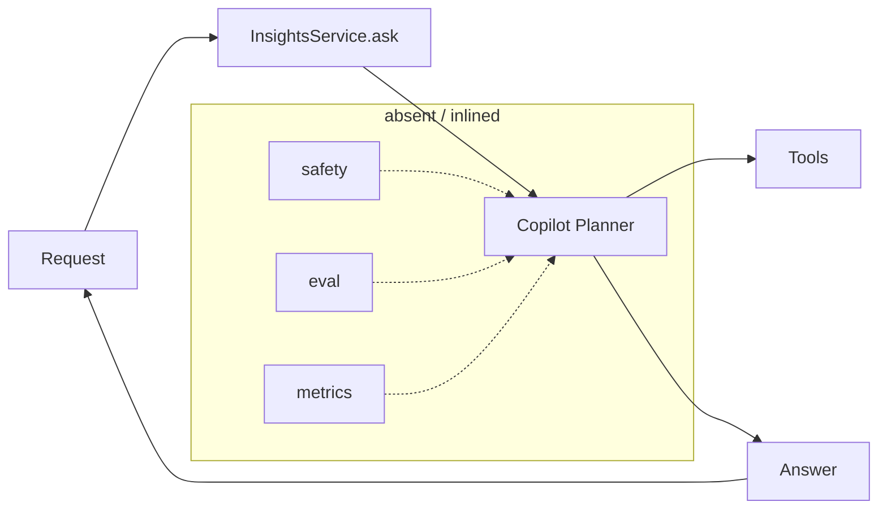
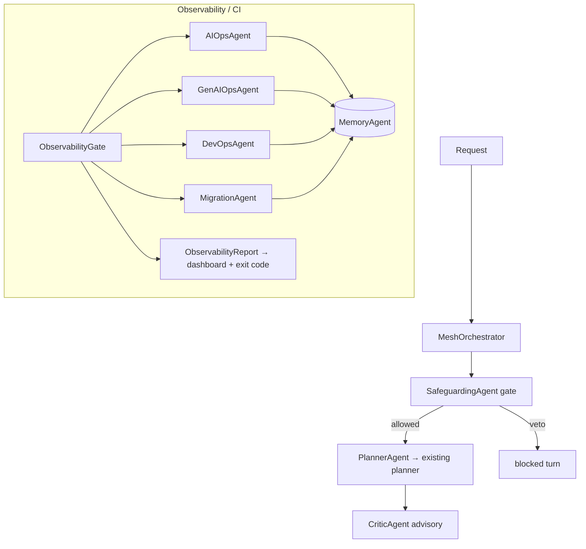

# Agent Mesh — Multi-Agent Remodel Report

**Date:** 2026-06-03
**Component:** `voicelive-api-salescoach` backend — `src/agents/`
**Scope:** Wulo (speech therapy) + Wulo Academy / Pathfinder Learn (adaptive learning) share this backend
**Status:** Delivered, ships dark behind `AGENT_MESH_ENABLED`
**Tests:** 114 passing · 26 exports · 0 errors

---

## 1. What we solved

The backend had grown a single, monolithic AI path: the **Copilot planner** inside
`InsightsService.ask()` did everything — interpreted the request, called tools,
generated the answer — with safety, quality, ops-health, eval and release checks
either inlined, scattered, or simply absent. That created four concrete problems:

1. **No separation of concerns.** Safeguarding, quality review, and operational
   health were tangled into one call path, so any change risked the whole loop.
2. **Verdicts went nowhere.** We had signals (eval results, metrics, migration
   risk) but nothing *composed* them — no dashboard could read them and no CI
   step could fail on them.
3. **No safe seam to add governance.** Adding a guardrail meant editing the hot
   path, which is exactly where regressions hurt most (this backend serves
   regulated speech-therapy *and* minors on Wulo Academy).
4. **All-or-nothing rollout.** There was no way to introduce agent behaviour
   incrementally, dark, with zero behaviour change.

We solved this by **remodelling the AI path into a mesh of small, single-purpose,
read-only agents** plus an integration layer that runs them together and turns
their verdicts into a dashboard payload and a CI exit code — all gated behind one
flag so it ships dark and changes nothing until enabled.

---

## 2. How we built it

### 2.1 Principles

- **Thin internal base, zero new dependency.** A `MeshAgent` base class (tool
  allow-lists, call budgets, structured `[agent-mesh]` logging) — no external
  agent framework added to `requirements`.
- **Agents never raise on a bad outcome.** They *return verdicts*; callers
  decide. A denied action, a low-quality answer, or an anomaly is data, not an
  exception.
- **Fail closed.** Unknown safeguarding kinds, unreadable eval verdicts, and
  unknown migration operations all default to the safe/blocking side.
- **Dark by default.** Nothing runs unless `AGENT_MESH_ENABLED` is set (or an
  explicit `force=True` for CI). Off = byte-identical behaviour.
- **New files only.** The working tree was dirty; every change was a new agent
  file + tests, plus one already-clean wiring point.

### 2.2 The agents (built incrementally, one per increment)

| Agent | Role | Fails… |
| --- | --- | --- |
| `PlannerAgent` | 1:1 delegation to the existing planner | n/a (pass-through) |
| `SafeguardingAgent` | veto authority over actions | closed (unknown kind → block) |
| `AIOpsAgent` | ops-health snapshot from durable metrics | open (returns `None` if disabled/empty) |
| `GenAIOpsAgent` | release eval gate | closed (`.blocking` on skip/error) |
| `CriticAgent` | advisory quality review of answers | open (never blocks) |
| `MeshOrchestrator` | safeguarding gate + planner composition | closed (first veto short-circuits) |
| `MemoryAgent` | bounded append-only outcome recorder | open (never raises on bad payload) |
| `DevOpsAgent` | staging-only release go/no-go | closed (non-staging → blocked) |
| `MigrationAgent` | schema-change risk review (never executes SQL) | closed (unknown op → review) |

### 2.3 The integration layer — `ObservabilityGate`

The final piece is a plain coordinator (deliberately *not* a `MeshAgent`) that
**composes** the read-only agents instead of reimplementing them:

- `run_cycle(reader=, eval_handler=, target_env=, migration_steps=, ...)` runs
  only the agents whose inputs are supplied, records each outcome into a shared
  `MemoryAgent`, and aggregates into one `ObservabilityReport`.
- Dark-by-default: flag off + not forced → `STATUS_DISABLED`, exit 0, no agents
  run.
- The whole cycle is wrapped in `try/except` → any blow-up degrades to
  `STATUS_ERROR` so a cron/CI step never crashes.
- `ObservabilityReport.exit_code` is `1` only on a hard block (critical ops, a
  no-go/non-staging deploy, or a destructive migration); otherwise `0`.
- A `scripts/run_observability_gate.py` CLI mirrors the existing
  `run_eval_gate.py` pattern: prints the JSON report, exits with the gate code.

---

## 3. How we use it

### 3.1 As a CI gate (pipeline step)

```bash
python scripts/run_observability_gate.py --force --target-env staging \
    --allow-skipped-eval --out artifacts/observability.json
```

Exit `0` → pipeline proceeds. Exit `1` → a hard gate failed (the JSON `reasons`
say which). The `--out` artifact is the dashboard payload.

### 3.2 As an observability cron (metrics-only)

```bash
python scripts/run_observability_gate.py --force --metrics
```

Reads durable ops metrics (when `DURABLE_METRICS_RESOURCE_ID` is set), records
the snapshot into memory, and emits a `degraded`/`ok` report without gating any
deploy.

### 3.3 Programmatically

```python
gate = ObservabilityGate()
report = gate.run_cycle(reader=reader, eval_handler=handler,
                        target_env="staging", force=True)
report.as_dict()      # dashboard payload
report.exit_code      # CI verdict
gate.history(limit=20)  # recent recorded outcomes
```

---

## 4. Risks & mitigations

| Risk | Mitigation |
| --- | --- |
| New code changes production behaviour | Dark by default behind `AGENT_MESH_ENABLED`; off = byte-identical; wrap failures fall back to the unwrapped planner |
| A gate/agent crashes the hot path or a pipeline | Agents never raise on bad outcomes; the gate wraps the cycle → `STATUS_ERROR` instead of an exception |
| An agent takes a mutating action | All mesh agents are read-only; tool allow-lists exclude deploy/apply/rollback/run_sql; `MigrationAgent` never executes SQL |
| Prod accidentally green-lit | `DevOpsAgent` is staging-only by design; any non-staging target is hard-blocked, never widened |
| Destructive migration slips through | `MigrationAgent` blocks DROP/TRUNCATE/DELETE even with a rollback, unless an explicit kill-switch downgrades it to review; unknown ops default to review |
| Eval skipped/unavailable silently passes | `GenAIOpsAgent` is fail-closed: a skipped/errored eval is `.blocking` unless explicitly allowed |
| Dependency-injection footgun | Fixed a real defect: `MemoryAgent` defines `__len__`, so `memory or MemoryAgent()` discarded an empty injected buffer — switched to `is not None`. Lesson captured. |
| Scope creep / unreviewed surface area | New files only; no framework dependency; 114 tests gate every agent |

---

## 5. Former vs current architecture

### Former (monolithic)



- One call path does interpretation, tools, and generation.
- Safety/quality/ops are inlined, scattered, or missing.
- Signals exist but nothing composes them; no gate, no dashboard feed.

### Current (mesh)



- Each concern is an isolated, testable, read-only agent.
- The planner is wrapped, not replaced (off = unchanged).
- `ObservabilityGate` composes the read-only agents into one report + CI verdict.
- Everything is observable via `[agent-mesh]` structured logs and `MemoryAgent`.

---

## 6. Next steps

1. **Enable in staging CI as non-blocking first** to gather a baseline of
   `degraded` vs `blocked` outcomes, then promote to gating (a one-line change —
   it already fails closed).
2. **Persist history beyond the process.** `MemoryAgent` is in-process and
   bounded; add a thin sink forwarding each recorded outcome to Log Analytics /
   the existing Application Insights export so a real dashboard can read it.
3. **Schedule the metrics-only cron** once `DURABLE_METRICS_RESOURCE_ID` is set.
4. **Fold `CriticAgent` into the gate** as a non-blocking `degraded` signal once
   planner results are available to the cycle.
5. **Add a lint note / helper** discouraging `x or Default()` for DI defaults
   across the agents package (the `__len__` footgun).
6. **Document the flag lifecycle** — set an explicit decision date and the
   evidence required before `AGENT_MESH_ENABLED` becomes default-on.

---

## 7. How this affects Wulo Academy (Pathfinder Learn)

Wulo Academy runs on **this same backend** (the Pathfinder Learn module:
diagnostics, mastery, intervention plans, approvals, xAPI, RLS). The remodel is
directly relevant because Academy serves **minors preparing for exams**, so its
governance bar is at least as high as the therapy product's.

**Immediate, low-risk wins for Academy:**

- **Safeguarding as a first-class gate.** The learner tutor's actions can flow
  through `SafeguardingAgent` (fail-closed), giving a single auditable veto point
  for child-facing content — aligning with the existing RLS + parental-consent
  posture.
- **Quality review of tutor answers.** `CriticAgent` can flag uncited claims,
  empty answers, and oversized responses in the adaptive tutor — advisory only,
  so it never breaks a lesson but surfaces quality regressions.
- **Eval gate on learning content.** `GenAIOpsAgent` can run the learning eval
  suite (safety probes for minors) as a release gate before any tutor-prompt
  change reaches Academy learners.
- **Ops-health + dashboard feed.** Academy already emits Pathfinder Learn
  route/decision/xAPI counters and OTel metrics; `AIOpsAgent` +
  `ObservabilityGate` give a ready-made way to fold those into a single
  health/anomaly report and a CI gate, reusing the existing Application Insights
  export.
- **Migration safety for the learning schema.** Academy's learning tables are
  RLS-protected with Alembic migrations; `MigrationAgent` provides a read-only
  pre-deploy review that blocks destructive changes to learner data.

**Constraints to respect for Academy specifically:**

- Keep the mesh **dark** on Academy until the learning eval suite and
  safeguarding rules are validated for the JSS–SS3 learner context.
- `DevOpsAgent` stays **staging-only**; do not widen it to gate Academy prod
  deploys without a separately reviewed path.
- This work lives on `main`; **do not** port JSS3/SS3 diagnostic/exam-prep
  features onto the `feat/pathfinder-learn-ownership-multichild` (phase-0)
  branch — that boundary is intentional.

**Net effect:** Wulo Academy gets a reusable, dark-by-default governance and
observability layer — safeguarding veto, answer-quality review, eval gating,
ops-health, and migration safety — without changing the learner experience until
each control is explicitly switched on.

---

## 8. Appendix — files delivered

| File | Purpose |
| --- | --- |
| `backend/src/agents/base.py` | `MeshAgent` base, budgets, flag, logging |
| `backend/src/agents/{planner,safeguarding,aiops,genaiops,critic,memory,devops,migration}_agent.py` | the nine agents |
| `backend/src/agents/orchestrator.py` | `MeshOrchestrator` |
| `backend/src/agents/observability_gate.py` | integration coordinator + report |
| `backend/scripts/run_observability_gate.py` | cron / CI CLI |
| `backend/tests/unit/test_*_agent.py`, `test_observability_gate.py` | 114 tests |
| `backend/src/agents/__init__.py` | 26 exported symbols |
