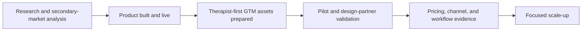
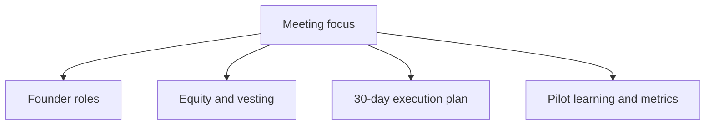

# Wulo Cofounder Meeting Note

**Date:** April 11, 2026  
**Purpose:** Align on the main founder decisions for Wulo's next phase.

## Why This Meeting Matters

Wulo is now beyond idea stage:

- the product is live
- the therapist workflow is largely built
- core GTM materials exist
- the next phase is pilot validation, not open-ended product building

So this meeting should focus less on brainstorming and more on founder alignment.

## What Already Exists

- live product at `sen.wulo.ai`
- therapist auth, practice flow, review, charts, recommendations, and planning
- legal and compliance groundwork for pilot readiness
- revised therapist-first GTM plan
- landing page strategy draft
- webinar topics and LinkedIn content drafts
- outreach shortlist and pilot one-pager

## What This Meeting Needs To Decide

1. Founder ownership
- Who owns product and execution?
- Who owns clinical content and therapist credibility?
- Who owns outreach, webinar, landing page, and follow-up?

2. Equity and vesting
- What is the equity split?
- Will equity vest over 4 years with a 1-year cliff?
- What happens if one founder reduces involvement or leaves?

3. Next 30 days
- Who owns therapist outreach?
- Who owns webinar planning and delivery?
- Who owns pilot recruitment and learning capture?
- What will we measure weekly?

## Current Stage

## Meeting Focus

## Short Agenda

### 1. Current reality — 5 min

- Wulo is live
- GTM direction is therapist-first
- the company is in pilot-validation stage

### 2. Founder ownership — 12 min

- role split
- decision rights
- operational responsibilities

### 3. Equity and vesting — 12 min

- split logic
- vesting
- cliff
- reduced involvement / exit scenarios

### 4. Next 30 days — 10 min

- outreach
- webinar
- landing page improvements
- pilot recruitment
- metrics and feedback capture

### 5. Close — 6 min

- what was agreed
- what needs legal follow-up
- next checkpoint date

## Proposed Discussion Topics

- What can only you do because of your speech therapy expertise?
- What can only I do because of product and execution ownership?
- What are the exact responsibilities each of us is taking for the next 90 days?
- What equity split feels fair given role, time, and risk?
- Are we both aligned that vesting is necessary?
- Who owns pilot learning, pricing feedback, and weekly GTM tracking?

## Desired Outcome

By the end of the meeting, we should have:

- a clear role split
- a draft position on equity and vesting
- named owners for the next 30 days
- a simple weekly measurement plan
- a list of items that need legal documentation