# Pathfinder Learn Architecture Contract

Status: Stage A binding contract, before code refactor
Date: 2026-05-23
Repo root: `voicelive-api-salescoach/`

This contract governs the refactor of the Wulo SEN speech-therapy platform into Pathfinder Learn. It binds the future implementation to the current repo reality: Flask 3.1, flask-sock, SQLAlchemy/Alembic where present, psycopg/Postgres RLS, Azure Voice Live, Azure Speech, OpenAI SDK, GitHub Copilot SDK, Azure Monitor OpenTelemetry, Bicep and azd. It does not introduce Temporal, NestJS, Hermes, Keycloak, or MinIO into this repo.

## A.1 Architecture Contract

### Binding Promises

- Pathfinder Learn adds a new `learning/` bounded context without deleting or rewriting the existing Wulo therapy domain. Existing therapy pilots keep running while the `Student / Teacher / Skill / DiagnosticItem` ontology is introduced behind a new context. (PRD §1, §2.1 G1, §9.1, §9.3, §13)
- The existing therapy API surface is frozen for the refactor. Changes that alter `Child / Therapist / Phoneme / Exercise / Session / PracticePlan` behavior require a separate compatibility plan and cannot be bundled into Pathfinder Phase 0. (PRD §2.1 G1, §2.2, §9.1, §13)
- The contract that survives every model swap is CI-enforced from Phase 0: every cloud call has an offline-capable fallback; every model output declares its language and provenance; every persisted event is expressible as an xAPI statement. (PRD §9.4, §6.2, §7.10, §7.11)
- AI never mutates student state automatically. Planner output can create a draft or pending suggestion only; teacher or counsellor approval is required for state mutation. (PRD §2.2, §5.2 T2, §7.3, §7.5)

### Bounded Contexts

| Context | Path | Status | Responsibility | Import Rule |
|---|---|---|---|---|
| Therapy | `backend/src/therapy/` once namespaced; current legacy modules under `backend/src/services/`, `backend/src/routes/`, `backend/src/schemas/` remain the frozen surface until moved | Retain, frozen | Speech therapy children, therapists, phonemes, exercises, pronunciation, practice plans, child memory | MUST NOT import from `learning/`. (PRD §2.1 G1, §2.2, §9.1, §13) |
| Learning | `backend/src/learning/` | New | Students, teachers, classes, cohorts, skills, standards, diagnostic items, responses, mastery, intervention plans, xAPI learning events | MUST NOT import from `therapy/`. (PRD §2.1 G1, §7.4, §7.5, §9.3) |
| Career | `backend/src/learning/career/` | New sub-module | Career pathway ranking, wage bands, demand trends, counsellor narration, Orchestrator + Advisor gate | May import from `learning/` contracts and `common/`, not from `therapy/`. (PRD §5.3, §7.6, §9.3) |
| Common | `backend/src/common/` | New shared primitives | Audit, approval state, policy gate, egress gateway interfaces, xAPI shape, provenance, RLS actor helpers, offline sync primitives | May be imported by `therapy/` and `learning/`; cannot import either bounded context. (PRD §7.9, §7.10, §7.11, §9.4) |

The import direction rule is enforced by CI from Phase 0 with an import-boundary lint: `learning/` and `therapy/` are siblings; `common/` is the only shared dependency. (PRD §6.2, §9.4)

### Invariants

1. No AI intervention, career narration, or teacher-facing suggestion reaches a human without a typed `PlanValidator[TPlan]` result. Validator failure is fail-closed and writes an audit reason. (PRD §5.2 T2, §5.3 C2, §7.5, §7.6, §9.3)
2. Every planner payload carries `lang: BCP47`, `provenance[]`, and a typed output kind before it can render in the UI. (PRD §7.3, §7.8, §9.4)
3. Every `MasteryEvent`, `Approval`, `Override`, and `DiagnosticCompletion` is convertible to a schema-valid xAPI statement before persistence. (PRD §6.2, §7.10, §7.12, §9.4)
4. The database remains the tenant isolation authority. New learning tables use Postgres RLS, forced RLS, and session GUCs; the current SQLite `StorageService` remains a dev/test compatibility path only. (PRD §6.2, §7.9, §9.1, §13)
5. The planner and model adapters never hold DB credentials. Domain state is reachable only through a curated tool surface that enforces RBAC, RLS, validation, idempotency, and audit server-side. (PRD §7.10, §8 Security, §9.1)
6. Every cloud dependency has an offline-capable fallback or queued state that is visible to the user. Last-write-wins is forbidden for mutating events. (PRD §2.1 G3, §6.1, §7.11, §8 Availability)
7. PII is redacted before LLM egress and rehydrated only after policy checks. Student data must not enter model memory or cache without explicit teacher approval. (PRD §7.6, §7.7, §8 Security, §8 Privacy)
8. Teacher-approved durable memory is the only runtime personalization memory for students. Proposed facts must be approved, edited, or rejected by a teacher. (PRD §7.7, §9.1)
9. The approvals queue is the state-machine boundary for AI suggestions: `draft -> pending -> approved | edited_approved | rejected`. (PRD §5.2 T2, §5.2 T4, §7.5)
10. Phase gates must be reproducible offline. Cloud services may be mocked or replaced by local sinks in verification, but contract shape and audit evidence must be real. (PRD §6.2, §7.11, §10)

### Public Interface Contracts

| File Path | Public Models / Protocols | Contract |
|---|---|---|
| `backend/src/learning/models.py` | `Student`, `Teacher`, `Class`, `Cohort`, `Skill`, `Standard`, `DiagnosticItem`, `StudentResponse`, `MasteryEstimate`, `MasteryEvent`, `InterventionPlan`, `CareerPlan`, `Provenance`, `LanguageTag` | Pydantic models for the learning ontology and all planner-visible payloads. `MasteryEstimate` is a typed JSONB union with `kind="beta"` for MVP and `kind="elo"` for the alternate estimator. (PRD §2.1 G1, §7.4, §7.5, §7.6, §7.8) |
| `backend/src/learning/planner.py` | `LearningPlanner`, `CareerPlanner`, `PlannerRequest`, `PlannerResult[TPlan]`, `OfflinePlannerFallback` | Protocols mirror `InsightsPlanner.run_turn`: bounded turn, stateless adapter, caller-owned persistence and authorization, per-turn budget. (PRD §7.5, §7.6, §9.1, §9.3) |
| `backend/src/learning/validator.py` | `PlanValidator[TPlan]`, `ValidationRule[TPlan]`, `ValidationResult`, `ValidationFailure` | Parametrised validator for schema, semantics, safety rules, catalogue grounding, language, provenance, xAPI convertibility, and fail-closed audit reasons. (PRD §7.5, §7.6, §9.3, §9.4) |
| `backend/src/learning/mastery.py` | `MasteryEstimator` Protocol, `BetaBKT`, `Elo`, `MasteryUpdateInput`, `MasteryUpdateResult` | Estimator interface with Beta-BKT as MVP implementation and Elo as an alternate swap. Deep-KT is out of scope for MVP. (PRD §2.2, §7.4, §9.2) |
| `backend/src/learning/xapi.py` | `XAPIStatement`, `XAPIActor`, `XAPIVerb`, `XAPIObject`, `XAPIResult`, `xAPIEmitter`, `AuditLedgerXAPISink`, `RalphXAPISink` | Every persisted learning event must validate as xAPI. Phase 0 writes schema-valid statements to the audit-ledger sink; Ralph is the Phase 1 LRS sink. (PRD §6.2, §7.10, §7.12, §9.2) |
| `backend/src/learning/career/models.py` | `CareerPathway`, `LabourMarketSignal`, `WageBand`, `DemandTrend`, `CareerNarration`, `CareerRefusal` | Career data must declare source, recency, confidence, language, and provenance for each datapoint. (PRD §5.3, §7.6, §9.2, §9.3) |
| `backend/src/learning/career/planner.py` | `CareerPlanner`, `OrchestratorAdvisor`, `AdvisorDecision` | Two-agent career narration gate for grounding, age-appropriateness, safety, PII, and typed refusal. (PRD §5.1 S4, §5.3 C2, §7.6) |
| `backend/src/common/policy_gate.py` | `PolicyGate`, `PolicyDecision`, `PolicyRule`, `PolicyContext` | Server-side policy is authoritative for `(role, intent, tenant_policy, student_consent_state)` and returns allow, clarify, deny, or approval-required. (PRD §7.1, §7.2, §7.3, §7.9) |
| `backend/src/common/approved_memory.py` | `ApprovedMemoryStore`, `MemoryProposal`, `ApprovedMemoryItem` | Teacher-approved memory port of the therapist-approved pattern. (PRD §7.7, §9.1) |
| `backend/src/common/audit.py` | `AuditLedger`, `AuditEvent`, `AuditActor`, `AuditSignature` | Append-only audit abstraction over current `audit_log` and future Postgres trigger-backed ledger. (PRD §7.12, §9.1) |
| `backend/src/common/egress_gateway.py` | `LLMEgressGateway`, `RedactionEnvelope`, `ModelOutputEnvelope`, `OfflineEgressFallback` | Only path to LLM providers; handles PII redaction, tenant budgets, content safety, OTel spans, language, provenance, and offline queuing. (PRD §7.6, §7.8, §8 Security, §8 Observability) |
| `backend/src/common/offline_sync.py` | `OfflineSyncQueue`, `IdempotencyKey`, `ConflictResolution`, `QueuedWrite` | Offline writes are idempotency-keyed, replayed on reconnect, and conflict-resolved at the service. (PRD §2.1 G3, §7.11) |
| `backend/src/common/oneroster.py` | `OneRosterAdapter`, `RosterImportResult` | OneRoster 1.2 import for classes and enrolments. (PRD §5.5 H2, §7.10, §9.2) |
| `backend/src/common/case_loader.py` | `CASEAdapter`, `CurriculumFramework`, `CASEImportResult` | CASE loader for curriculum frameworks, MVP NERDC JSS2 Maths. (PRD §7.10, §9.2, §12) |
| `backend/src/common/labour_market.py` | `LabourMarketLoader`, `CrosswalkRecord`, `LabourMarketDatasetManifest` | Loads O*NET to ESCO crosswalk, World Bank STEP, NBS/KNBS wage and demand data with provenance and recency. (PRD §5.3 C1, §7.6, §9.2, §12) |
| `frontend/src/learning/components/MultimodalIntentBar.tsx` | `MultimodalIntentBarProps`, `IntentBarMode` | Single entry surface with idle, typing, and listening modes; no always-on mic. (PRD §7.1, §7.2) |
| `frontend/src/learning/components/results/*` | `StreamPanel`, `ResultCard`, `PendingApprovalCard`, `RefusalCard` | Render states enforce provenance footer and block mutating intents from streaming prose. (PRD §7.3, §6.2) |

## A.2 Components

| Component | Path | Language | Owner Context | Verdict | Source Pattern From CV | Upstream | Downstream |
|---|---|---|---|---|---|---|---|
| `MultimodalIntentBar` | `frontend/src/learning/components/MultimodalIntentBar.tsx` | TypeScript/React | learning | Build | "schema-driven UI" | User input, device mic tap, cached policy snapshot | `IntentClassifier`, `PolicyGate`, result renderer (PRD §7.1, §7.2, §7.3) |
| `IntentClassifier` | `frontend/src/learning/intent/intentClassifier.ts` and `backend/src/learning/intent.py` | TypeScript + Python fallback | learning | Replace-OSS/build wrapper | "small models for routing and intent" | `MultimodalIntentBar`, content pack | `PolicyGate`, workflow dispatch (PRD §7.1, §7.2, §8 Performance) |
| `PolicyGate` | `backend/src/common/policy_gate.py`, `backend/policy.yaml` | Python + YAML | common | Build | "Approval-policy-as-data (`approval-policy.yaml`) read identically by TypeScript and Python" | JWT actor, intent, tenant policy, consent state | Planner dispatch, `RefusalCard`, approval-required state (PRD §7.1, §7.2, §7.3, §7.9) |
| `LearningPlanner` | `backend/src/learning/planner.py` | Python | learning | Build on retained adapter | "custom orchestration over the Azure OpenAI SDK" | `PolicyGate`, `MasteryEstimator`, approved memory, tool surface | `PlanValidator[TPlan]`, approvals queue, xAPI (PRD §7.5, §9.1, §9.3) |
| `CareerPlanner` | `backend/src/learning/career/planner.py` | Python | learning/career | Build | "deterministic recommendation ranker with clear provenance" | Mastery profile, labour-market signals, consent state | `OrchestratorAdvisor`, counsellor UI, `RefusalCard` (PRD §5.3, §7.6, §9.3) |
| `PlanValidator[TPlan]` | `backend/src/learning/validator.py` | Python | learning | Build from retained pattern | "plan-validation and normalisation layer on top of structured outputs" | Planner JSON, catalogue rules, safety rules | Audit reason, approvals queue, xAPI emitter (PRD §7.5, §7.6, §9.3, §9.4) |
| `MasteryEstimator` | `backend/src/learning/mastery.py` | Python | learning | Build interface | "plan validation, guardrails, durable human-approved memory and explainable ranking with full provenance" | Student response, item metadata, prior estimate | Teacher heatmap, `LearningPlanner`, xAPI event (PRD §7.4, §9.2) |
| `BetaBKT` | `backend/src/learning/mastery.py` | Python | learning | Replace-OSS wrapper (`pyBKT`) | "Multi-tenant PostgreSQL with row-level security tested in CI" | `MasteryEstimator` input | `MasteryEstimate(kind="beta")` (PRD §2.2, §7.4, §9.2) |
| `Elo` | `backend/src/learning/mastery.py` | Python | learning | Build alternate | "deterministic recommendation ranker with clear provenance" | `MasteryEstimator` input | `MasteryEstimate(kind="elo")` (PRD §7.4, §9.3) |
| `OrchestratorAdvisor` | `backend/src/learning/career/advisor.py` | Python | learning/career | Build | "Orchestrator + Advisor two-agent safety pattern" | `CareerPlanner`, egress gateway, policy gate | `CareerNarration`, `CareerRefusal`, red-team eval logs (PRD §5.3 C2, §7.6, §8 Eval) |
| `ApprovedMemoryStore` | `backend/src/common/approved_memory.py` | Python | common | Retain/re-aim | "therapist-controlled durable memory" | Teacher review actions, planner proposals | Runtime personalization, provenance, audit (PRD §7.7, §9.1) |
| `xAPIEmitter` | `backend/src/learning/xapi.py` | Python | learning/common | Build | "fully auditable state changes" | Mastery, approvals, overrides, diagnostic completions | Audit-ledger sink, Ralph LRS sink, district export (PRD §6.2, §7.10, §7.12, §9.2) |
| `OneRosterAdapter` | `backend/src/common/oneroster.py` | Python | common | Replace-OSS wrapper | "MIS / CRM adapter pattern" | District SIS export, school CSV fallback | Classes, enrolments, tenant hierarchy (PRD §5.5 H2, §7.10, §9.2) |
| `CASEAdapter` | `backend/src/common/case_loader.py` | Python | common | Build around CASE spec | "schemas, contracts, workflows, CI verification and trace-evidence scripts" | NERDC JSS2 Maths framework | Skill and standard catalogue, validator grounding (PRD §7.10, §9.2, §12) |
| `LabourMarketLoader` | `backend/src/common/labour_market.py` | Python | common | Build | "deterministic recommendation ranker with clear provenance" | O*NET, ESCO, World Bank STEP, NBS/KNBS datasets | `CareerPlanner`, counsellor UI, reports (PRD §5.3 C1, §7.6, §9.2, §12) |
| `OfflineSyncQueue` | `frontend/src/learning/offline/syncQueue.ts`, `backend/src/common/offline_sync.py` | TypeScript + Python | common | Build | "queue-based workflow automation" | IndexedDB writes, service worker, API replay endpoint | Conflict resolver, audit ledger, xAPI emitter (PRD §2.1 G3, §7.11, §8 Availability) |
| `AuditLedger` | `backend/src/common/audit.py`, existing `audit_log`, future Alembic tables | Python + SQL | common | Retain/extend | "Append-only audit ledger with Postgres triggers + `REVOKE UPDATE, DELETE`" | All persisted events, validator failures, approval actions | Signed evidence bundle, DPO export, inspector export (PRD §7.12, §8 Privacy, §9.1) |
| `LLMEgressGateway` | `backend/src/common/egress_gateway.py` | Python | common | Build | "PII-redacting LLM egress gateway" | Planners, advisor, model adapters | Azure OpenAI/Foundry, OpenAI SDK, offline fallback, OTel cost spans (PRD §7.6, §7.8, §8 Security, §8 Observability) |
| `TraceEvidenceScripts` | `scripts/trace_evidence_phase_*.py` | Python | common | Build | "Authored customer-runnable trace-evidence scripts per phase" | Synthetic fixtures, local sinks | Signed bundles and CI gates (PRD §6.2, §10) |

## A.3 Data Flow

Canonical happy path: student diagnostic response to teacher-approved intervention.

1. Student submits a diagnostic answer in the PWA through the diagnostic UI or `MultimodalIntentBar`. Budget: local UI response under 100 ms. Offline fallback: answer is written to IndexedDB with an idempotency key. (PRD §5.1 S1, §5.1 S2, §7.1, §7.11)
2. `IntentClassifier` classifies the request on-device as `diagnostic.run`, `practice.explain_concept`, or another MVP intent. Budget: <= 200 ms on low-end Android. Offline fallback: same on-device model and cached taxonomy. (PRD §7.1, §7.2, §8 Performance)
3. `PolicyGate` evaluates role, intent, tenant policy, and consent state. Budget: <= 50 ms server-side or <= 50 ms from cached snapshot offline. Offline fallback: signed policy snapshot can deny or queue, but not widen permission. (PRD §7.1, §7.2, §7.3, §7.9)
4. `MasteryEstimator` updates the skill estimate from the response and diagnostic item metadata. Budget: <= 100 ms. Offline fallback: local Beta-BKT update writes a queued `MasteryEvent` with idempotency key. (PRD §7.4, §7.11, §8 Performance)
5. `LearningPlanner` prepares a structured `InterventionPlan` using bounded tool calls and the retained stateless adapter shape. Budget: time-to-first-intervention <= 5 min target, <= 15 min hard floor. Offline fallback: suggestion is marked `queued_online_required`; deterministic rules can produce a cached low-risk suggestion from the last 50 teacher suggestions. (PRD §6.1, §7.5, §7.11, §9.1)
6. `PlanValidator[TPlan]` validates schema, semantics, catalogue grounding, safety rules, language, provenance, and xAPI convertibility. Budget: <= 100 ms. Offline fallback: same pure-Python validator. (PRD §7.5, §7.6, §9.3, §9.4)
7. `OrchestratorAdvisor` is used for career narration and any minor-facing pathway explanation. Budget: first token <= 1.5 s p95 when online. Offline fallback: queue narration and show typed refusal/queued state; deterministic pathway card can show sourced data without generated narration. (PRD §5.1 S4, §5.3 C2, §7.6, §8 Performance)
8. HITL approval queue stores the AI suggestion as `pending`. Teacher approves, edits and approves, or rejects with one-tap reason. Budget: teacher UI heatmap <= 1 s and class heatmap within 5 s. Offline fallback: approval action is queued with idempotency key and conflict-checked on sync. (PRD §5.2 T1, §5.2 T2, §5.2 T4, §7.5)
9. `xAPIEmitter` converts `MasteryEvent`, `Approval`, `Override`, or `DiagnosticCompletion` to `XAPIStatement`. Budget: <= 50 ms local schema validation. Offline fallback: audit-ledger sink persists locally; Ralph replay happens on reconnect. (PRD §6.2, §7.10, §7.11)
10. `AuditLedger` appends the event, validator result, actor, tenant, provenance, prompt hash if applicable, and evidence manifest pointer. Budget: synchronous with state mutation. Offline fallback: local durable ledger plus signed replay manifest. (PRD §7.12, §8 Privacy, §9.1)
11. Teacher UI renders the updated heatmap, pending/approved suggestion, and provenance footer. Budget: heatmap <= 1 s; provenance footer is mandatory. Offline fallback: renders last-N suggestions and local mastery from IndexedDB. (PRD §5.2 T1, §6.2, §7.3, §7.11)

```mermaid
flowchart LR
    A[Student response\n<=100 ms\nOffline: IndexedDB queue] --> B[IntentClassifier\n<=200 ms\nOffline: on-device model]
    B --> C[PolicyGate\n<=50 ms\nOffline: signed policy snapshot]
    C --> D[MasteryEstimator\n<=100 ms\nOffline: local Beta-BKT]
    D --> E[LearningPlanner\n<=5 min target\nOffline: queued or deterministic cached suggestion]
    E --> F[PlanValidator TPlan\n<=100 ms\nOffline: same validator]
    F --> G[OrchestratorAdvisor\n<=1.5 s first token when online\nOffline: queued/refusal state]
    G --> H[HITL approval queue\nTeacher approve/edit/reject\nOffline: idempotent queued action]
    H --> I[xAPIEmitter\n<=50 ms validation\nOffline: audit sink]
    I --> J[AuditLedger\nappend-only\nOffline: local signed replay manifest]
    J --> K[Teacher UI\nheatmap <=1 s\nOffline: last-N suggestions]
```

## A.4 Trust Boundary

### Identity Zones

| Zone | Trust Level | Components | Rules |
|---|---|---|---|
| Device | Untrusted | PWA, IndexedDB, Service Worker, on-device intent classifier, content packs | Can cache signed policy and content packs; cannot widen permissions; all queued writes carry idempotency key and actor proof. (PRD §3, §7.1, §7.11) |
| Tenant API | Trusted post-JWT or student class-code/PIN exchange | Flask API, flask-sock transport, storage facade, policy gate | Validates JWT/session, sets request actor, enforces role and tenant policy before tool dispatch. (PRD §7.1, §7.9, §8 Security) |
| Planner Sandbox | Sandboxed | `LearningPlanner`, `CareerPlanner`, Copilot/OpenAI adapters | No DB credentials; bounded tool calls; wall-clock budget; stateless adapter leaves persistence and authorization with caller. (PRD §7.5, §7.6, §9.1) |
| Tool Surface | Trusted narrow boundary | Existing `InsightsTool` registry in Phase 0; MCP-bounded tool surface in later phases | RBAC, RLS, validation, idempotency, and audit enforced server-side; tools must return serializable JSON only. (PRD §7.10, §9.1, §9.3) |
| DB | RLS-enforced source of truth | Postgres storage, Alembic migrations, audit ledger | Uses session GUCs for `app.current_user_id`, `app.current_user_role`, `app.current_user_email`; new learning tables must enable and force RLS. PRD target GUC names `app.tenant_id`, `app.class_id`, `app.user_id`, `app.role` are introduced with the learning migrations. (PRD §6.2, §7.9, §9.1) |

### Egress Rules

| Component | May Call External Service? | External Service | PII Redaction Point | Provenance Stamping | Offline Fallback |
|---|---:|---|---|---|---|
| `IntentClassifier` | No for hot path | None in MVP hot path | Not applicable | Intent confidence stamped locally | On-device model and cached taxonomy. (PRD §7.1, §8 Performance) |
| `PolicyGate` | No | None | Not applicable | Policy rule id stamped on allow/deny | Signed policy snapshot. (PRD §7.1, §7.3, §7.11) |
| `LearningPlanner` | Yes, through `LLMEgressGateway` only | Azure OpenAI/Foundry, OpenAI SDK, GitHub Copilot SDK adapter | Gateway redacts student PII before provider call | Planner result includes model, prompt version, tool trace, `lang`, `provenance[]` | Queue or deterministic cached suggestion. (PRD §7.5, §7.8, §8 Security) |
| `CareerPlanner` | Yes, through `LLMEgressGateway` only | Azure OpenAI/Foundry, OpenAI SDK | Gateway redacts PII and age-sensitive context | Each pathway datapoint carries source, recency, confidence | Deterministic sourced card, narration queued. (PRD §5.3, §7.6, §8 Security) |
| `OrchestratorAdvisor` | Yes, through `LLMEgressGateway` only | Azure OpenAI/Foundry or offline judge | Gateway redacts; Advisor checks PII before output | Advisor decision stamps rule id and refusal reason | Refusal or queued review. (PRD §5.3 C2, §7.6, §8 Eval) |
| `xAPIEmitter` | Yes when online | Ralph LRS | Payload excludes non-required PII; actor scoped to pseudonymous account when required | xAPI statement id, verb, object, context, result | Audit-ledger sink and replay queue. (PRD §7.10, §7.11) |
| `OneRosterAdapter` | Yes on admin sync | SIS/OneRoster source | Import-time minimization | Import manifest and source hash | CSV/manual import pack. (PRD §5.5 H2, §7.10) |
| `LabourMarketLoader` | Yes on scheduled/admin load | O*NET, ESCO, World Bank STEP, NBS/KNBS sources | Public data only | Dataset manifest, source URL, recency | Versioned static dataset pack. (PRD §7.6, §9.2, §12) |

### AuthN/AuthZ Matrix

| Actor | Authentication | Allowed Actions | Scope | Must Be Denied |
|---|---|---|---|---|
| Student JSS2 | Class code, first name, 4-digit PIN | Start diagnostic, answer items, request concept explanation or hint | Own active class and own diagnostic session | Career advice in student practice surface; any state mutation beyond own response. (PRD §3, §5.1, §7.2) |
| Student JSS3+ | Class code, first name, 4-digit PIN, career consent | Explore pathways, view visible why-this explanation | Own profile and consented career features | Ungated career narration; unsupported future claims. (PRD §3, §5.1 S4, §7.6) |
| Teacher | School SSO via Google/Microsoft/Entra federation | View class heatmap, review suggestions, approve/edit/reject, override mastery with reason, export class report | Assigned class, school tenant | Cross-class or cross-tenant reads; planner auto-apply. (PRD §3, §5.2, §7.9) |
| Counsellor | SSO plus step-up | Pull mastery profile, view pathway shortlist, approve career conversation narrative | Assigned school/counselling caseload | Career narration without Advisor gate for under-16 student. (PRD §3, §5.3, §7.6, §7.9) |
| Parent/Guardian | Phone + OTP | Read own child progress, see home-practice recommendation, file export/erase request | Own child only | Teacher heatmaps, cohort analytics, career data without consent. (PRD §3, §5.4, §8 Privacy) |
| Head Teacher/Inspector | SSO | School heatmap, cohort gap trend, signed PDF/xAPI export | School or district scope granted | Individual-level unsupported AI claims without provenance. (PRD §3, §5.5, §7.12) |
| DistrictAdmin/DPO | Admin SSO | DSR workflow, audit export, policy flags, kill switches | Tenant/district admin scope | Direct planner tool calls or student mutation outside audited workflow. (PRD §3, §5.4 P2, §7.12, §11) |
| Agent/Planner | No human login; service identity only | Call curated tools inside per-turn budget | Scope granted by caller context | Direct DB access, credential possession, cross-scope tool args. (PRD §7.5, §7.10, §9.1) |

## A.5 IaC Scope

IaC uses Bicep + azd for this repo because the existing deployment posture and PRD require Bicep + azd. General Azure landing-zone guidance was reviewed, but the tool suggestion to avoid azd conflicts with this repo contract and is not adopted.

### Provisioned By IaC

- Azure Container Apps environment and apps for API, planner/egress worker, offline-sync worker, and Ralph LRS when Phase 1 starts. (PRD §7.10, §8 Availability, §9.2)
- Azure Database for PostgreSQL Flexible Server with migrations, RLS, backups, private connectivity where environment allows, and least-privilege database users. (PRD §6.2, §7.9, §8 Security, §9.1)
- Azure Key Vault with managed-identity access for model credentials, HMAC signing keys, database connection secrets where needed, and external integration secrets. (PRD §8 Security, §9.1)
- Azure Storage Account for content packs, signed export bundles, trace evidence bundles, policy snapshots, and static dataset manifests. (PRD §7.11, §7.12, §9.2)
- Azure AI Search for hybrid retrieval over curriculum, policy, source catalogues, and course/career grounding where cloud search is used. (PRD §8, §9.1)
- Azure OpenAI / Foundry model deployments or provider configuration used through the egress gateway only. (PRD §7.5, §7.6, §8 Security)
- Application Insights, Log Analytics, and Azure Monitor OpenTelemetry wiring for web -> API -> planner -> egress correlation and per-tenant cost spans. (PRD §8 Observability)
- Managed identities and RBAC assignments for each app, scoped to the narrow resources it uses. (PRD §8 Security, §9.1)
- Optional private endpoints/VNet integration for pilot/prod where budget and school network posture allow. (PRD §8 Security, §8 Availability)

### Stays Config / Manual

- DPO approval, DPIA sign-off, NDPR data-flow approval, and NERDC licensing conversation. (PRD §10 Phase 0, §12)
- School device procurement, school LAN, SIM/data plan, and on-device tablet management. (PRD §2.1 G3, §11)
- Labour-market dataset licence acceptance and source refresh schedule ownership. (PRD §7.6, §12)
- Native-rater recruitment and eval adjudication. (PRD §7.8, §8 Eval)
- Tenant commercial configuration and district pricing model. (PRD §12)

### Resource List and Environment Overrides

| Resource | Dev SKU / Setting | Pilot SKU / Setting | Prod SKU / Setting | Purpose |
|---|---|---|---|---|
| Container Apps Environment | Consumption, single region | Consumption or workload profile if sustained school-hours load requires it | Workload profile, zone-redundant where available | Hosts Flask API, planner worker, egress worker, sync worker, Ralph LRS. (PRD §8 Availability, §9.2) |
| API Container App | 0-1 min replicas | 1-3 replicas, school-hours autoscale | 2+ replicas, autoscale, health probes | Tenant API and flask-sock transport. (PRD §7.1, §7.8, §8 Performance) |
| Planner/Egress Container App | 0-1 min replicas | 1-2 replicas, per-tenant budget env vars | 2+ replicas, per-tenant budget config | LLM gateway, bounded planner turns, redaction. (PRD §7.5, §7.6, §8 Security) |
| Offline Sync Worker | 0-1 min replicas | 1 replica | 2 replicas | Replays idempotent queued writes and xAPI statements. (PRD §7.11) |
| Ralph LRS | Local container optional | Container app with persistent Postgres backing | Dedicated managed container and backup | xAPI landing target. (PRD §6.2, §7.10, §9.2) |
| PostgreSQL Flexible Server | Burstable, small storage | General Purpose, PITR, school-hours monitoring | General Purpose or Memory Optimized if required | RLS source of truth and audit ledger. (PRD §7.9, §7.12) |
| Storage Account | LRS, dev container | LRS/ZRS depending region and budget | ZRS where available | Content packs, evidence bundles, signed exports. (PRD §7.11, §7.12) |
| Key Vault | Standard | Standard, purge protection on | Standard/Premium if HSM-backed keys required | Secrets, signing keys, model config. (PRD §8 Security) |
| Azure AI Search | Basic where enabled | Basic/S1 based on catalogue size | S1+ if district scale requires it | Hybrid RAG over catalogues and grounding material. (PRD §9.1, §8 Cost) |
| Azure OpenAI / Foundry | Small model deployment only | Small router + larger synthesis deployment | Capacity planned by eval and load | Planner/advisor synthesis behind egress. (PRD §7.5, §7.6, §8 Cost) |
| Application Insights + Log Analytics | Dev retention | Pilot retention aligned to DPO | Prod retention policy and export | Correlation, costs, guardrail alerts. (PRD §8 Observability, §8 Privacy) |

### Managed Identities, RBAC, Secrets, Network

- `mi-pathfinder-api-{env}` can read Key Vault app secrets, connect to Postgres, write audit/export blobs, and emit telemetry. (PRD §8 Security)
- `mi-pathfinder-planner-{env}` can read model config from Key Vault, call model deployments, write OTel spans, and cannot access raw database credentials. (PRD §7.5, §7.6, §8 Security)
- `mi-pathfinder-sync-{env}` can read/write the offline queue container, write xAPI replay results, and call API-internal replay endpoints. (PRD §7.11)
- `mi-pathfinder-export-{env}` can read ledger slices and write signed ZIP bundles. (PRD §7.12)
- Key Vault secret names: `postgres-url`, `hmac-signing-key-active`, `hmac-signing-key-next`, `azure-openai-endpoint`, `azure-openai-deployment-router`, `azure-openai-deployment-synthesis`, `copilot-github-token` only when Copilot SDK needs token auth, `ralph-admin-token`, `oneroster-client-secret`. (PRD §8 Security, §7.10)
- Network posture: dev may use public endpoints with IP restrictions; pilot prefers private endpoints for Postgres/Storage/Key Vault where cost allows; prod requires private endpoints or equivalent network isolation for data stores. (PRD §8 Security, §8 Availability)

### Explicitly Out Of IaC Scope

- Android tablet provisioning and MDM. (PRD §2.1 G3)
- School LAN, firewall, SIM/data, and device charging logistics. (PRD §11 Operational)
- DPO legal approvals and DPIA sign-off. (PRD §8 Privacy, §10 Phase 0)
- NERDC item-bank licence negotiation. (PRD §12)
- Manual native-rater adjudication. (PRD §7.8, §8 Eval)
- Any runtime introduction of Temporal, NestJS, Hermes, Keycloak, or MinIO into this repo. Keycloak remains a possible external IdP for a future ministry environment only, not an application dependency here. (PRD §7.9, constrained by repo stack reality)

## A.6 In / Out Of Scope For MVP 12-Week Pilot

| In | Out |
|---|---|
| New `learning/` bounded context beside retained therapy surface. (PRD §2.1 G1, §9.3) | Rewriting or deleting therapy workflows: never in this refactor. (PRD §2.2, §9.1) |
| JSS2 Maths diagnostic with 50 items x 4 skills, NERDC-aligned. (PRD §2.1 G2, §7.4, §10 Phase 2) | Deep-KT, DKT, SAKT: post-MVP research, not pilot. (PRD §2.2, §7.4) |
| Beta-BKT mastery with uncertainty, plus Elo as alternate implementation behind `MasteryEstimator`. (PRD §7.4, §9.2) | Phoneme-level pronunciation scoring in Pathfinder: stays in `therapy/`, optional oral-reading-fluency add-on later. (PRD §2.2, §7.8) |
| Teacher heatmap with mastery and uncertainty bands. (PRD §5.2 T1, §7.4) | Multi-country rollout: Phase 4+ after Nigeria pilot. (PRD §2.2) |
| `LearningPlanner` intervention suggestions with HITL approve/edit/reject. (PRD §5.2 T2, §7.5) | University or scholarship matching engine: never in MVP; possible separate product later. (PRD §2.2) |
| Provenance footer on every AI suggestion. (PRD §6.1, §6.2, §7.3) | Parent native app: never for MVP; mobile web PWA only. (PRD §2.2, §5.4) |
| Offline diagnostic, mastery update, intent classifier, policy gate snapshot, and last 50 teacher suggestions. (PRD §2.1 G3, §7.11) | Automated AI mutation of student state: never. (PRD §2.2, §7.5) |
| English and Yoruba planner I/O with `lang: BCP47`. (PRD §2.1 G4, §7.8) | Full voice path for every language: Phase 3, with possible Phase 4 slip depending native-rater capacity. (PRD §7.8, §10 Phase 3, §12) |
| Career Navigator for JSS3+ with counsellor gate, wage band, demand trend, source and recency. (PRD §2.1 G5, §5.3, §7.6) | Career advice in the JSS2 student practice surface: never. (PRD §5.1 S3, §7.2) |
| OneRoster 1.2 class/enrolment import and xAPI export contract. (PRD §5.5 H2, §7.10) | District-wide pricing and umbrella tenancy decisions: post-pilot discovery. (PRD §12) |
| CASE loader for curriculum framework, MVP NERDC JSS2 Maths. (PRD §7.10, §9.2, §12) | Production multi-region DR: Phase 4+ or prod-readiness hardening, not 12-week MVP. (PRD §8 Availability) |
| Signed PDF/ZIP evidence export and audit ledger slice. (PRD §5.2 T5, §7.12) | Self-hosted Keycloak inside this repo: never; external IdP adapter only if later required. (PRD §7.9, repo stack constraint) |

## A.7 Phased Delivery With Verification Gates

Phase numbering note: PRD §10 names Phase 0 as Discovery and Phase 1 as Foundations. The execution prompt requires a code-bearing "Phase 0" for branch `refactor/pathfinder-learn-phase-0`. This contract resolves the collision by defining Phase 0 as the architecture-and-code-foundation gate: it carries PRD §10 Phase 0 artefacts plus the smallest PRD §10 Phase 1 deliverable subset needed for Stage B. Later phases align with PRD §10.

| Phase | Goal | Deliverables | Verification Gate | Pass Criterion | Exit Artefact | Rollback |
|---|---|---|---|---|---|---|
| Phase 0 - Architecture and code foundation (PRD §10 Phase 0 + Phase 1 subset) | Establish the bounded context, contracts, lints, offline evidence path, and generic planning primitives without touching therapy. | `docs/architecture-contract.md`; `backend/src/learning/__init__.py`; `backend/src/learning/models.py`; `backend/src/learning/planner.py`; `backend/src/learning/validator.py`; `backend/src/learning/mastery.py`; `backend/src/learning/xapi.py`; `scripts/trace_evidence_phase_0.py`; CI lints for offline fallback, language+provenance, xAPI shape. | `cd backend && pytest -k "phase_0 or learning or xapi"` and `python ../scripts/trace_evidence_phase_0.py --offline` | Synthetic student response runs offline through intent stub, Beta-BKT update, planner stub, `PlanValidator[TPlan]`, xAPI schema validation, and audit-ledger sink; command exits 0 and prints a signed evidence bundle path. | Signed Phase 0 evidence ZIP with HMAC-SHA256 manifest, CI green badge, architecture contract. | Revert Phase 0 commits on `refactor/pathfinder-learn-phase-0`; no migration rollback should be needed unless Phase 0 adds Alembic learning tables, in which case run the downgrade for that single revision. |
| Phase 1 - Foundations (PRD §10 Phase 1) | Port the production-grade data spine into learning: RLS, audit, approvals, Ralph LRS, content-pack sync. | Alembic learning tables; `storage_postgres.py` learning methods or learning repository; `RLS_PROTECTED_TABLES` extended; approval queue learning rows; Ralph LRS IaC; content-pack manifest; offline sync API. | `make verify-phase-1` | Fresh database migration enables and forces RLS for every learning table; cross-tenant query returns empty rows; stub diagnostic emits a schema-valid xAPI statement to Ralph or local Ralph-compatible sink offline. | Foundation-runnable trace script and signed scope/DPIA artefact. | Alembic downgrade Phase 1 revision, disable `flag.learning.enabled`, route users to therapy-only app. |
| Phase 2 - Diagnostic and teacher view (PRD §10 Phase 2) | Deliver JSS2 Maths diagnostic, adaptive item selection, mastery heatmap, and teacher HITL interventions. | JSS2 item bank; `catsim` adapter behind item selection interface; teacher heatmap UI; `LearningPlanner`; provenance footer lint; `PendingApprovalCard`; text path of `MultimodalIntentBar`. | `make verify-phase-2` plus `pytest -k "diagnostic or mastery or provenance"` | One offline Playwright run completes diagnostic, mastery update, cached suggestion render, and teacher approval path; every suggestion renders `provenance[]`; xAPI and audit events are present. | One-school dry-run bundle: class heatmap screenshot, signed trace, approval/reject examples. | Disable `flag.learning.diagnostic.enabled` or `flag.ai_suggestions.<tenant>`; preserve raw responses and fall back to deterministic mastery report. |
| Phase 3 - Multilingual and career nav (PRD §10 Phase 3) | Add Yoruba language pack, voice path, Career Navigator, counsellor view, and parent view for the pilot. | Yoruba content pack; language eval slice; flask-sock voice transport adapter; `CareerPlanner`; `OrchestratorAdvisor`; labour-market loader; counsellor view; parent progress view. | `make verify-phase-3` plus `pytest -k "career or multilingual or advisor"` | Native-rater eval slice has >=200 Yoruba cases with kappa >=0.7; career red-team safety >=99%; under-16 narration passes Advisor or surfaces typed refusal; offline career card renders deterministic sourced data. | 3-school pilot readiness demo recording, red-team report, signed dataset manifests. | Disable `flag.career_planner.<tenant>` and `flag.voice_path.<tenant>`; keep diagnostic and teacher view live. |
| Phase 4 - Pilot operations (PRD §10 Phase 4) | Operate the 12-week pilot with weekly red-team probes, KPI tracking, board packs, and controlled release ramps. | Eval roll scripts; canary config; auto-rollback hooks; monthly board report; DPO export; weekly adversarial probe set; cost dashboards. | `make verify-phase-4` and `python scripts/trace_evidence_phase_4.py --tenant <pilot-tenant> --offline-fixtures` | KPI report computes diagnostic completion, approved intervention rate, provenance coverage, safety, DSR turnaround, and cost per student; canary rollback triggers on guardrail regression in fixture set. | Board pack, DPO evidence export, final pilot report. | Flip tenant flags to deterministic/no-AI mode; rollback prompt/model version; preserve audit and xAPI exports for inspection. |

## A.8 Risks And Kill Switches

| Tier | Risk | Mitigation | Kill Switch | Who Can Pull It |
|---|---|---|---|---|
| Safeguarding | Career narration gives harmful or off-policy advice to a minor. (PRD §11) | Advisor gate, refusal-first UX, native-rater eval >=99% safe, counsellor sign-off. (PRD §5.3 C2, §7.6, §8 Eval) | `flag.career_planner.<tenant>=off`; command: `python scripts/tenant_flags.py set <tenant> career_planner off --reason safeguarding` | DPO, safeguarding lead, engineering on-call |
| Accuracy | Mastery estimator mis-flags a high-performing student. (PRD §11) | Surface BKT uncertainty, teacher override with one-line reason, offline eval before release. (PRD §5.2 T3, §7.4, §8 Eval) | `flag.mastery_estimator.<tenant>=deterministic_previous`; command: `python scripts/tenant_flags.py set <tenant> mastery_estimator deterministic_previous --reason accuracy` | Head teacher for tenant, learning lead, engineering on-call |
| Compliance | Student PII leaks to LLM provider training. (PRD §11) | Egress gateway redacts and rehydrates, per-tenant provider-training opt-out, DPIA evidence. (PRD §7.6, §8 Security, §8 Privacy) | `flag.llm_egress.<tenant>=blocked`; command: `python scripts/tenant_flags.py set <tenant> llm_egress blocked --reason compliance` | DPO, engineering on-call |
| Operational | Tablet offline for 3+ days and sync conflicts accumulate. (PRD §11) | Idempotency keys, service-side conflict resolution, queued writes with TTL, visible sync state. (PRD §7.11) | `flag.offline_sync.<tenant>=manual_review`; command: `python scripts/tenant_flags.py set <tenant> offline_sync manual_review --reason sync_conflict` | School admin, engineering on-call |
| Reputational | Inspector cites unsupported AI suggestion in report. (PRD §11) | Provenance footer non-optional, signed export bundle, rejection feeds eval. (PRD §6.2, §7.3, §7.12) | `flag.ai_suggestions.<tenant>=deterministic_only`; command: `python scripts/tenant_flags.py set <tenant> ai_suggestions deterministic_only --reason provenance` | DPO, head teacher, engineering on-call |

Additional cross-cutting emergency switch: `flag.learning.<tenant>=read_only` freezes mutating learning workflows while preserving read-only audit, xAPI export, and deterministic reports. This can be pulled by the DPO or engineering on-call. (PRD §7.11, §7.12, §11)