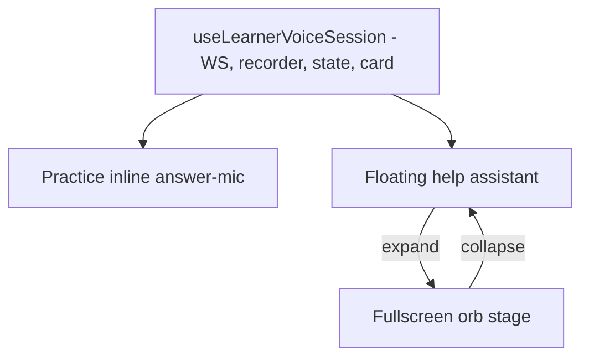

# Plan — Practice voice‑answer + theme‑aware floating help assistant

**Repo:** `voicelive-api-salescoach`  ·  **Branch:** `feat/pathfinder-learn-ownership-multichild`
**Date:** 2026‑06‑09

---

## Problem

On the learner Practice screen (`/home?startPractice=1`), the **"🎙️ Talk to tutor"**
chip sits at the top next to **"Voice on"** and acts as a *mode switch*: clicking it
tears down the question card and mounts a separate full‑screen "Listening" voice UI
(`z-index: 120`, `position: fixed; inset: 0`). The question disappears, and on staging
the new surface appears to "do nothing" (it auto‑starts recording, so a silent orb means
a mic‑permission or `/ws/voice` connect failure — not a dead handler).

Two distinct concepts are conflated into one top button:

1. **Voice on/off** — TTS *out*: the tutor reads the card aloud (legitimate, keep it).
2. **Answering by voice** — STT *in*: the learner speaks an answer (should be an inline
   input affordance on the card, like a normal voice UI with a bottom mic).

Separately, the voice agent (the "Listening" orb screen) is the natural home for a
**free‑form "ask for help" assistant**, but today it is fullscreen‑only, its orb is
hard‑coded dark (so in light theme it looks disconnected), and its chrome uses a bespoke
`--scrim-*` token family instead of the app's `--pf-*` design system.

> Note: a **text** "Ask Pathfinder" FAB/drawer already exists
> (`e2e/pathfinder-ask-assistant.spec.ts`, `assistant/ask`). The floating **voice** help
> assistant introduced here must coexist with it, not duplicate or break it.

---

## Goals

- **(a)** Collapse "Talk to tutor" into an **inline bottom‑mic** on the Practice card.
  The question stays visible; tap an option **or** speak. Delete the top chip. Keep
  "Voice on".
- **(b)** Turn the voice agent into a **floating** "ask for help" assistant that:
  - aligns with **light/dark theme** (orb + stage fully token‑driven),
  - can **expand to fullscreen** and collapse back (session survives the resize),
  - uses the app's **`--pf-*` design tokens** for its panel chrome.

---

## Verified code map

| Concern | File | Notes |
| --- | --- | --- |
| Practice card | `frontend/src/learning/components/PracticeFullscreen.tsx` | REST answering via `runLearnerVoiceTurn`; `handleMcqAnswer` ~L260. "Talk to tutor" chip ⇒ `setTutorOpen(true)` ~L335; nested `LearnerTutorFullscreen` mount ~L369. "Voice on" toggle = TTS‑out via `useTtsPlayer` (keep). Footer hint ~L355 → becomes mic. |
| Voice agent | `frontend/src/learning/components/LearnerTutorFullscreen.tsx` | WS `/ws/voice`, `useRecorder('stream')`, orb, barge‑in. Auto‑starts recording on open (`micRequestedRef` effect ~L420). Bottom mic already exists (`micButton` footer ~L495). **Orb gradient hard‑coded dark ~L86.** Scrim `z-index: 120` full takeover. |
| Theme tokens | `frontend/src/learning/theme/pathfinderThemeStyles.ts` | `[data-theme]` (dark default) ~L8, `[data-theme="light"]` ~L127, `[data-theme="dark"]` ~L169. Scrim tokens have light variants; **no `--scrim-orb-*` token yet**. Mic already tokenised (`--scrim-mic-bg`). |
| Design system | `frontend/src/learning/theme/pathfinder-tokens.ts` | `--pf-*` surface/line/shadow/space/type. |
| Theme controller | `frontend/src/learning/contexts/PathfinderThemeContext.ts` | `mode: 'light' \| 'dark'`, `toggle`, persisted. |
| Theme mount | `frontend/src/learning/PathfinderLearnApp.tsx` | `data-theme={mode}` on `FluentProvider` ~L1888 / ~L1905. |
| Host route | `frontend/src/learning/routes/StudentLearningHome.tsx` | Mounts `PracticeFullscreen` ~L3669 and `LearnerTutorFullscreen` ~L3681 (help/focus path). `tutorOpen` / `tutorFocusItem` state ~L2077; `onVoiceStateChange = setTutorVoice`. |
| Existing text help | `frontend/e2e/pathfinder-ask-assistant.spec.ts` | Text "Ask Pathfinder" FAB/drawer — must keep working. |

---

## Decisions (locked)

1. **Transport:** reuse the realtime `/ws/voice` path for practice voice‑answers
   (natural speech + barge‑in). Do **not** add a separate STT‑to‑REST path.
2. **Staging "does nothing":** treat as a real bug — verify `/ws/voice` connect + mic
   permission as part of Phase 0/A so the inline mic actually works.
3. **Help FAB scope:** **global** across the learner home, floating mode.
4. **"Voice on" stays;** only the top "Talk to tutor" chip is removed.

---

## Architecture

Extract the voice engine (WS session + recorder + state machine + audio/barge‑in +
card wiring) out of `LearnerTutorFullscreen` into a reusable headless core
(hook `useLearnerVoiceSession` or a render‑prop component). Two presentation shells
consume it:

- inline **answer‑mic strip** inside `PracticeFullscreen` (a),
- **floating/fullscreen** help panel (b).

`LearnerVoiceCardRenderer` is already shared by both.

---

## Phase 0 — Extract the voice engine (blocks A and B)

1. Pull WS (`/ws/voice`) + `useRecorder('stream')` + state machine + audio/barge‑in out
   of `LearnerTutorFullscreen` into `useLearnerVoiceSession`. Expose `state`,
   `recording`, `toggleRecording`, `inputLevel`, `card`, `sessionComplete`,
   `sendLearnerReply`, `close`.
2. Re‑implement `LearnerTutorFullscreen` on top of the hook (no behaviour change) so the
   existing test (`LearnerTutorFullscreen.test.tsx`) still passes.
3. **Connectivity fix:** verify the WS connects on staging and the mic‑permission
   fallback path is correct; surface a visible error state instead of a silent orb.

## Phase A — Practice card answers by voice (a)

1. Mount the engine **inline** (not `position: fixed`) beneath the still‑mounted card in
   `PracticeFullscreen`, with a persistent bottom **mic** + a small
   Listening/Thinking/Speaking indicator.
2. Route spoken answers through the WS card path, handing the current `card_id` to the
   session so WS drives subsequent cards; tap‑answers still work. Make one source
   authoritative for the visible card while voice is active (reconcile REST vs WS card
   state; confirm `card_id` continuity backend‑side).
3. **Delete** the "🎙️ Talk to tutor" chip, `setTutorOpen`, and the nested
   `LearnerTutorFullscreen` mount in `PracticeFullscreen`. Keep "Voice on".

## Phase B — Floating help assistant (b)

1. **Theme the orb/stage:** add `--scrim-orb-bg` (+ speaking/thinking glow) tokens with
   **light and dark** variants in `pathfinderThemeStyles.ts`; replace the hard‑coded
   gradient in the orb style (`LearnerTutorFullscreen.tsx` ~L86).
2. **Presentation mode** prop `'floating' | 'fullscreen'`:
   - *floating*: corner panel + FAB, chrome from `--pf-*` tokens
     (`--pf-surface`, `--pf-line`, `--pf-shadow-card-elevated`, `--pf-space-*`, pf type),
   - *fullscreen*: today's `inset: 0` scrim orb stage,
   - expand/collapse control toggles mode; the engine stays mounted (session survives).
3. **Global Help FAB** in `StudentLearningHome.tsx`, reusing the existing `tutorOpen` /
   `focusItem` plumbing, opening the assistant in floating mode. Keep the existing
   **text** Ask Pathfinder FAB intact (decide placement so the two don't collide).

---

## Test & evaluation strategy (no regressions)

**Unit / component (Vitest):** `npm test`
- `LearnerTutorFullscreen.test.tsx` still green after the refactor.
- New: `useLearnerVoiceSession` reducer/state transitions; inline practice mic maps a
  spoken answer to the correct `mcq-tap`; chip removal; floating↔fullscreen mode toggle
  keeps session mounted; orb reads from CSS variables (no hard‑coded color).

**E2E (Playwright):** `npm run test:e2e` — extend existing specs, add new ones. Mock the
realtime socket with `page.routeWebSocket('**/ws/voice', …)` so tests are deterministic
(no live Azure). Cover **every feature**:
- *Practice (a):* `/home?startPractice=1` — card visible; bottom mic present; the top
  "Talk to tutor" chip is **gone**; "Voice on" still toggles; mocked speech answer
  advances the card while the card stays mounted; mic‑denied shows a visible error, not a
  silent orb.
- *Floating (b):* global Help FAB opens the floating assistant; expand → fullscreen orb
  stage; collapse → floating; close. Session/WS stays alive across expand/collapse.
- *Theme:* extend `pathfinder-theme.spec.ts` — in **light** and **dark**, assert the orb
  background resolves from the themed token (computed style differs between modes; no
  fixed `#101012`), and floating panel uses `--pf-*` surfaces.
- *Regression guard:* `pathfinder-ask-assistant.spec.ts` (text drawer), `pathfinder-voice.spec.ts`,
  `learner-voice-ss3.spec.ts`, `pathfinder-end-to-end.spec.ts`, `pathfinder-routes.spec.ts`
  all still pass.

**Visual / manual capture:** `npm run capture:flow-assets` to refresh the real‑app flow
screenshots and eyeball the practice mic + themed orb in both modes.

**Evaluations (backend, no learning regression):** run the repo's learner‑voice / card
eval suite against the WS card path to confirm `card_id` continuity and that voice
answers score identically to tap answers (parity). Use the existing exercise/eval prompts
under `data/exercises/*` and the backend test suite (`backend/tests`) as the regression
baseline; compare pass‑rate before vs after.

**Gates (all must pass):** `npm run lint` · `npm run build` (tsc) · `npm test` ·
`npm run test:e2e` · backend `pytest` (and eval parity) green.

---

## Out of scope

- Backend realtime tutor logic changes beyond what `card_id` continuity requires.
- Replacing the existing **text** Ask Pathfinder assistant.
- Visual redesign of the question card itself.
