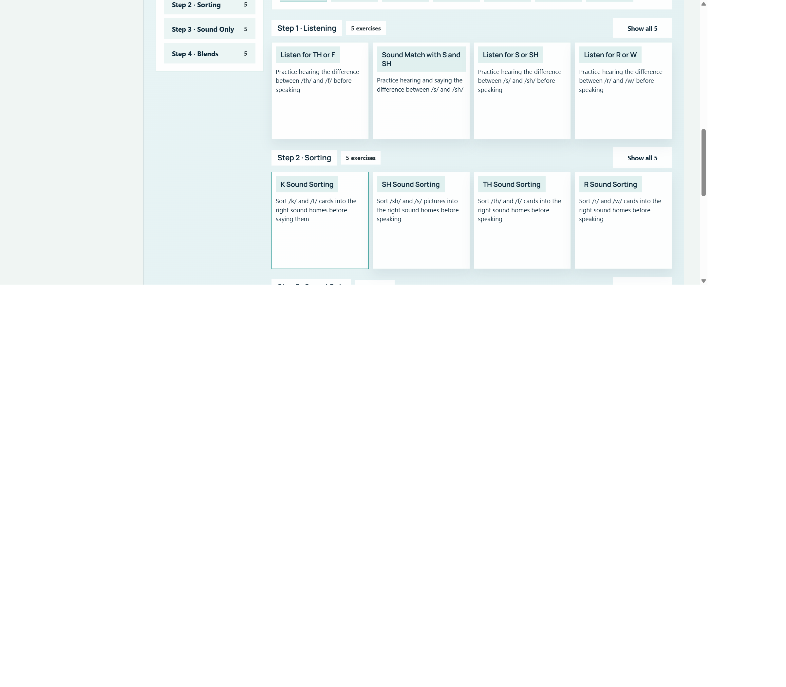
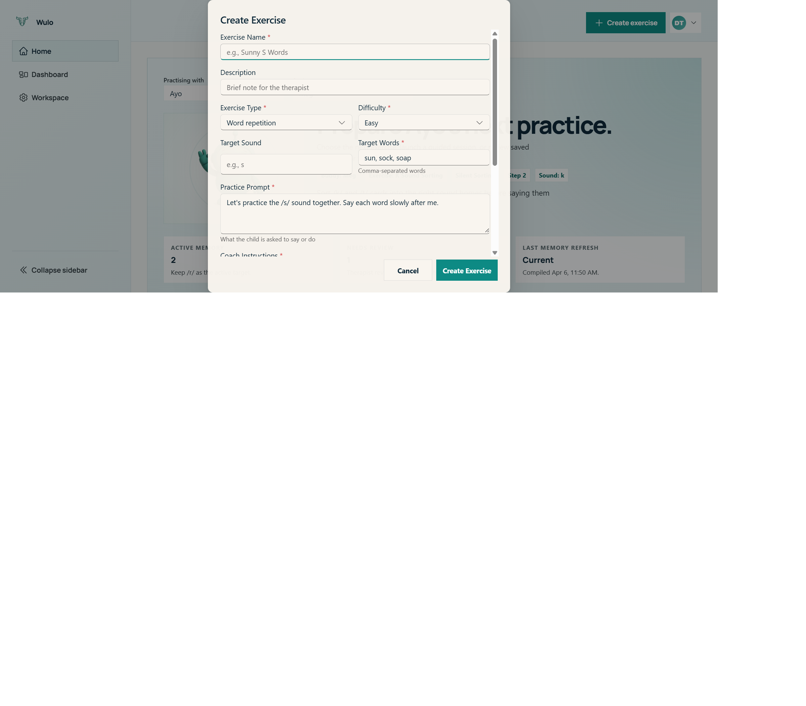

# Wulo Therapist User Guide

**Version:** 1.0  
**Last updated:** April 4, 2026  
**Platform:** Web application for desktop and tablet

## Table of contents

1. [Welcome to Wulo](#welcome-to-wulo)
2. [Getting started](#getting-started)
3. [Therapist dashboard](#therapist-dashboard)
4. [Managing child profiles](#managing-child-profiles)
5. [Built-in exercise library](#built-in-exercise-library)
6. [Creating custom exercises](#creating-custom-exercises)
7. [Running a practice session](#running-a-practice-session)
8. [Understanding session results](#understanding-session-results)
9. [Progress dashboard and analytics](#progress-dashboard-and-analytics)
10. [AI practice planner](#ai-practice-planner)
11. [Session review and history](#session-review-and-history)
12. [Settings and configuration](#settings-and-configuration)
13. [Best practices for therapists](#best-practices-for-therapists)
14. [Glossary](#glossary)
15. [Troubleshooting](#troubleshooting)

## Welcome to Wulo

Wulo is a therapist-supervised speech practice platform designed to support short, structured sessions with children. It combines an exercise library, an AI voice buddy, real-time pronunciation feedback, and therapist-facing review tools so you can run practice sessions and then quickly decide what to do next.

Wulo is intended for speech-language therapists and other supervised practitioners working on articulation, listening discrimination, and early sound practice. It is especially useful when you want practice to feel engaging for the child while still keeping the session organised and clinically purposeful.

At a high level, the workflow is simple:

1. Select a child profile.
2. Choose a built-in or custom exercise.
3. Start the session and let the child interact with the AI buddy.
4. Review pronunciation, engagement, and session-quality data.
5. Record your own feedback and plan the next step.

Wulo supports practice. It does not replace clinical judgement, diagnosis, or therapist-led intervention planning.

> Note: Wulo should be used in supervised settings. A therapist or responsible adult should remain nearby during child sessions.

## Getting started

### Logging in

Wulo supports sign-in through Google and Microsoft. When you open the app in a browser, you are taken to the sign-in screen. Choose your provider and complete sign-in as you normally would.

After authentication, the platform keeps your session active so you do not need to sign in again each time you refresh during normal use. If the session expires, Wulo returns you to the sign-in screen.

To log in:

1. Open Wulo in your browser.
2. Select either the Google or Microsoft sign-in option.
3. Complete authentication.
4. Wait for the app to open the mode selection screen.

> Tip: Use the same sign-in provider consistently if your organisation uses more than one account type.

### Choosing therapist mode or child mode

After sign-in, Wulo shows a mode selector. This helps keep therapist tools and child-facing tools separate.

| Mode | Best for | Main features |
| --- | --- | --- |
| Therapist mode | SLTs, supervisors, staff | Exercise selection, analytics, session review, AI planner, settings, custom exercise authoring |
| Child mode | Child-facing use during practice | Simplified exercise selection, AI buddy interaction, immediate session feedback |

Use therapist mode when preparing a session, reviewing results, adjusting settings, or creating exercises. Use child mode when the child is ready to work directly with the AI buddy.

### First-time onboarding

On first use, therapists may be asked to complete a short onboarding flow.

This typically includes:

1. Confirming a therapist PIN so therapist-only areas stay protected.
2. Reading the supervised-practice consent.
3. Acknowledging privacy and safe-use notes before beginning.

> Note: Consent acknowledgement is required before the first child session can start.

## Therapist dashboard

The therapist dashboard is the main control area. It is designed to let you move quickly between exercise setup, child selection, and progress review.

### Main areas of the dashboard

The dashboard typically includes:

- A welcome or hero section with the Wulo mascot and quick-start cues.
- A button to create a custom exercise.
- A grid or canvas of built-in exercises.
- A sidebar with navigation and child selection.

The sidebar gives you access to:

- Home
- Dashboard
- Settings
- Child profile selector
- Logout

### How to navigate

1. Open therapist mode.
2. Use the sidebar to move between the home view, the analytics dashboard, and settings.
3. Use the child selector near the top of the navigation area to choose whose data you are viewing.
4. Return to Home whenever you want to select an exercise and begin a new session.

On smaller screens, the navigation may collapse so the main content has more space.

> Tip: Before reviewing analytics, always check which child profile is active. Dashboard data follows the selected child.

## Managing child profiles

Child profiles help Wulo keep practice sessions, scores, and therapist notes organised per child.

### What a child profile is used for

Each child profile acts as the container for:

- Saved sessions
- Session scores and metrics
- Therapist notes
- Practice plans
- Progress over time

### Selecting a child

To select a child:

1. Open therapist mode.
2. Find the child selector in the sidebar or top control area.
3. Choose the child's name.
4. Confirm that the selected child remains visible before you start a session.

Once a child is active, any new session, review, or plan is tied to that profile.

### What therapists should check before starting

Before each session, confirm:

1. The correct child is selected.
2. You are looking at the right sound target or current therapy goal.
3. The previous session notes match the plan for today.

> Tip: Treat the active child indicator as part of your pre-session checklist. It prevents data being attached to the wrong profile.

## Built-in exercise library

Wulo includes a library of structured exercise types that support both receptive and expressive speech work. The library spans common sound targets such as /k/, /r/, /s/, /sh/, /th/, and contrastive listening activities.

### Exercise types available

| Exercise type | What it supports | What the child does | Speaking required |
| --- | --- | --- | --- |
| Listening minimal pairs | Auditory discrimination | Listens to contrasting words and chooses the correct picture or option | No |
| Silent sorting | Sound categorisation | Sorts words or pictures into sound groups | No |
| Sound isolation | Isolated production | Repeats the target sound on its own | Yes |
| Vowel blending | Consonant-vowel blending | Repeats sound-vowel combinations such as consonant plus long or short vowel patterns | Yes |
| Word repetition | Single-word production | Repeats target words after the AI buddy | Yes |
| Minimal pairs | Contrastive production | Repeats paired words that differ by one sound | Yes |
| Sentence repetition | Connected speech practice | Repeats short target-rich sentences | Yes |
| Guided prompt | Carryover and conversational practice | Responds to guided questions or story prompts using target sounds | Yes |

### Clinical progression

The library supports a useful progression from easier receptive tasks into harder expressive tasks.

One practical order is:

1. Listening minimal pairs
2. Silent sorting
3. Sound isolation
4. Vowel blending
5. Word repetition
6. Minimal pairs
7. Sentence repetition
8. Guided prompt or story-based carryover

This makes it easier to match an exercise to the child's current level rather than jumping straight into harder speaking tasks.

### Selecting a built-in exercise

1. Open the therapist dashboard or child home area.
2. Browse the exercise cards.
3. Look for the exercise name, target sound, and difficulty label.
4. Select the card you want.
5. Continue to session launch.

> Tip: If a child is struggling in expressive tasks, step back to a receptive task rather than repeating the same difficult activity.

## Creating custom exercises

Custom exercises let you adapt Wulo to a child's specific goals, vocabulary, or therapy sequence.

### When to create a custom exercise

Create one when:

- The built-in library does not match the child's current target.
- You want to use a personalised word list.
- You want to simplify or increase difficulty.
- You want a more specific therapist prompt.

### Fields in the custom exercise editor

The custom exercise editor includes fields such as:

| Field | What to enter |
| --- | --- |
| Name | Short label for the exercise |
| Description | Clinical purpose or context |
| Exercise type | One of the supported exercise structures |
| Target sound | The sound or sound pattern being practised |
| Target words | Comma-separated words or targets |
| Difficulty | Easy, medium, or hard |
| Child-facing prompt | The instruction the child hears or sees |
| System prompt | Optional guidance that shapes the AI buddy behaviour |

### Creating a new custom exercise

1. Open therapist mode.
2. Select Create Exercise.
3. Enter the exercise name and description.
4. Choose the exercise type.
5. Add the target sound and target words.
6. Choose the difficulty level.
7. Add a clear child-facing prompt.
8. Save the exercise.

After saving, the exercise becomes available in your exercise list.

### Editing, deleting, exporting, and importing

Wulo supports management actions for custom exercises so you can reuse and share them.

You can usually:

1. Open an existing custom exercise to edit it.
2. Delete it if it is no longer needed.
3. Export it as JSON for backup or sharing.
4. Import a JSON file to restore or reuse an exercise on another device.

> Note: Custom exercises are stored in browser storage. If browser data is cleared, locally saved custom exercises may be lost unless you have exported them.

## Running a practice session

Wulo's session flow is designed to be quick. The therapist sets up the session, the AI buddy takes the child through the exercise, and the platform returns results at the end.

### Before the child begins

Complete this short setup:

1. Select the correct child profile.
2. Choose the exercise.
3. Select an avatar if prompted.
4. Confirm audio readiness.
5. Hand the device to the child only after the session is ready.

### Session launch overlay

After exercise selection, Wulo shows a launch overlay while the session agent is prepared. This helps ensure the avatar, voice pipeline, and exercise context are ready before the child begins.

During this step:

- The AI buddy is prepared for the selected scenario.
- The interface waits for the voice session to be ready.
- The child should not start speaking until the active session screen appears.

> Note: Avoid refreshing during the launch overlay. Refreshing may interrupt setup and require the session to start again.

### Session screen layout

The active session screen has two main areas.

**Left side**

- Large avatar or video area
- Microphone control
- Inline pronunciation feedback after attempts

**Right side**

- Live transcript of the interaction
- Buddy and child messages
- Therapist controls or notes area, depending on context

For some exercise types, additional activity panels appear, such as picture choices, sorting targets, or sound cues.

### During the session

The AI buddy leads the exercise. Depending on the exercise type, the child may listen, choose, sort, or speak.

For speaking tasks, the typical flow is:

1. The buddy models or prompts the target.
2. The child uses the microphone.
3. Wulo processes the attempt.
4. Inline word-level feedback appears.
5. The buddy responds and moves to the next prompt.

The therapist can stay nearby, encourage the child, and step in if attention or regulation becomes a concern.

### Ending the session

Sessions end when the planned interaction completes or when the session is intentionally stopped. Once the session closes, Wulo opens the assessment view automatically.

> Tip: Let the child complete the turn structure where possible. Consistent turn-taking produces cleaner review data and a more reliable comparison across sessions.

## Understanding session results

At the end of a session, Wulo displays the assessment panel. This is the main post-session review area for the therapist.

### Overall score

The overall score is a summary signal that combines different aspects of the session. It is helpful for quick scanning, but it should not be treated as the only interpretation of the child's performance.

Use it as a pointer, then review the detail beneath it.

### Articulation metrics

The articulation area usually includes measures such as:

- Target sound accuracy
- Overall clarity
- Consistency

These help you decide whether the child was able to produce the intended target and whether performance stayed stable across attempts.

### Engagement metrics

The engagement area gives a useful view of how the child participated, not just how they sounded.

Common indicators include:

- Task completion
- Willingness to retry
- Self-correction attempts

These are especially useful when a low speech score may actually reflect fatigue, distraction, or frustration rather than a purely phonetic issue.

### Pronunciation review

The pronunciation review breaks performance down at word level. Words are typically colour-coded to show how accurate the production was.

Use this area to answer questions like:

- Which words were strongest?
- Which words remained difficult?
- Was the child more accurate at the beginning or end of the task?

### AI summary and therapist notes

Wulo can generate a narrative summary of strengths and areas for improvement. This is useful as a starting point, but your own note should remain the definitive clinical record.

To add therapist notes:

1. Open the notes area in the assessment panel.
2. Record brief observations.
3. Save the session feedback.

### Helpful session or needs follow-up

After review, mark the session as either:

- Helpful session
- Needs follow-up

This gives you a quick categorisation system when reviewing several sessions later.

> Tip: Use Needs follow-up when the data is unclear, the child was dysregulated, or the chosen task was a poor fit. That makes future review faster.

## Progress dashboard and analytics

The progress dashboard is the therapist's longer-term view. It helps you see patterns across sessions rather than judging a child from a single practice attempt.

### Summary metrics

At the top of the dashboard, Wulo surfaces headline measures such as:

- Total sessions
- Average score
- Recent trend

These are useful for a quick overview before you examine the charts.

### Key charts and what they mean

#### Progress trendline

This chart tracks score movement over time, usually across overall score, accuracy score, and pronunciation score.

Use it to look for:

- Improvement over several sessions
- Plateaus that suggest the need for a new strategy
- Sudden dips that may reflect off-days, poor audio conditions, or increased task difficulty

#### Session quality radar

The radar chart gives a balanced view across areas such as target accuracy, clarity, consistency, task completion, retry behaviour, and self-correction.

Use it when you want a quick visual profile of whether the main issue is production, engagement, or both.

#### Word-level heatmap

The heatmap highlights which words are consistently easy or difficult.

Use it to:

1. Identify repeated error words.
2. Choose starting words for the next session.
3. Check whether difficulty clusters around certain phonetic contexts.

#### Sound-level accuracy breakdown

This chart aggregates performance by target sound.

It is useful when a child is working across more than one target and you need to decide which sound should receive the next block of focused practice.

#### Celebration or mastery view

This area highlights progress milestones and can help support motivation.

It is often the best visual to share when showing the child or parent that progress is happening, even if it is gradual.

#### Session frequency heatmap

This view shows how regularly practice has occurred over time.

It is helpful when you suspect that consistency, rather than task quality, is affecting progress.

### How to use the dashboard in practice

1. Open Dashboard from the sidebar.
2. Confirm the correct child is selected.
3. Scan the summary metrics first.
4. Review the trendline and radar chart together.
5. Use word-level and sound-level charts to decide the next target.
6. Open specific sessions when you need more detail.

> Tip: Do not over-interpret a single low session. Look for patterns over at least several sessions before changing the wider plan.

## AI practice planner

The AI practice planner helps turn previous session information into a proposed next-session plan. It is designed to support therapist decision-making, not replace it.

### What the planner does

The planner can generate recommendations such as:

- Which exercises to use next
- How many sets or repetitions to try
- Whether to simplify or increase difficulty
- A rationale based on previous performance

### Creating a plan

1. Open a saved session or the dashboard for the selected child.
2. Choose the option to create a practice plan.
3. Add an optional therapist instruction.
4. Generate the plan.
5. Review the proposed exercises and rationale.

Examples of useful therapist instructions include:

- Focus on final /r/ only.
- Keep the session under 15 minutes.
- Use easier tasks before returning to sentence work.
- Prioritise confidence and successful repetitions.

### Refining a plan

If the first draft is not right, you can refine it.

1. Enter a follow-up instruction.
2. Ask for a shorter plan, a different exercise type, or a new emphasis.
3. Review the updated recommendation.

### Approving a plan

When the plan matches your clinical intention:

1. Approve the plan.
2. Keep it with the child's profile.
3. Use it to guide the next visit or classroom practice block.

> Note: Planner availability depends on the AI planning service being ready. If planner controls are unavailable, the rest of the therapist workflow should still function.

## Session review and history

Wulo stores completed sessions so you can return to them later.

### Viewing saved sessions

To review history:

1. Open the dashboard.
2. Choose the active child.
3. Open the session list.
4. Select a session for full detail.

Session entries typically include:

- Date and time
- Exercise used
- Score summary
- Any saved therapist feedback

### Reviewing one session in depth

When you open a saved session, look at:

1. The overall score.
2. Articulation and engagement measures.
3. Word-level pronunciation detail.
4. Your previous note, if present.
5. Whether the session was marked helpful or needing follow-up.

This is also the right place to decide whether the session should feed into the next practice plan.

## Settings and configuration

The settings area supports session readiness and accessibility.

### Audio settings

Before a session, especially on a new device, confirm:

- Correct microphone
- Correct speaker output
- Browser permission for microphone use

### Accessibility and interface options

Depending on the environment, you may have access to settings such as:

- Reduced motion
- Keyboard-friendly navigation
- Device-specific adjustments

### Account and environment checks

Settings may also show configuration or readiness information for connected features. This can help identify whether a missing planner feature or device issue is environmental rather than session-specific.

> Tip: If speech scoring seems poor across several children in one room, check the microphone and ambient noise before changing your therapy plan.

## Best practices for therapists

These habits usually make Wulo sessions more useful.

### 1. Match the exercise to the child's current level

Start with the easiest task that still produces meaningful information. If a child is not ready to produce a sound reliably, receptive discrimination tasks may tell you more than repeated failed productions.

### 2. Keep sessions focused

Use a clear goal for each session. For example, focus on one sound in one position rather than trying to cover several targets at once.

### 3. Use Wulo data as support, not verdict

Platform scores are helpful guides. Final interpretation should always include your own observations about fatigue, motivation, attention, and context.

### 4. Save short notes consistently

Even a one-line note such as "more accurate after modelling" or "attention dropped after 8 minutes" adds valuable context later.

### 5. Use the planner as a collaborator

The AI practice planner is strongest when you give it specific instructions. Ask for concrete changes rather than general ones.

### 6. Review trends, not just single sessions

Progress in speech practice is rarely perfectly linear. Look for repeated patterns before changing a therapy approach.

## Glossary

| Term | Meaning |
| --- | --- |
| Target sound | The speech sound being practised, such as /k/ or /r/ |
| Articulation clarity | A measure of how clearly speech is produced during the session |
| Consistency | How stable the child's productions are across repeated attempts |
| Engagement | How well the child participates in the task |
| Accuracy score | A score representing how closely the production matched the target |
| Pronunciation score | A broader pronunciation quality score provided by speech analysis |
| Minimal pairs | Two words that differ by one sound, used for contrast practice |
| Sound isolation | Producing a sound by itself rather than inside a word |
| Vowel blending | Combining a target sound with vowel sounds to practise transitions |
| AI buddy | The animated voice guide the child interacts with during sessions |
| Assessment panel | The post-session results view |
| Practice plan | A suggested next-session structure generated from session data and therapist instructions |

## Troubleshooting

### Session expired

If you are returned to sign-in unexpectedly:

1. Sign in again.
2. Confirm the correct mode and child.
3. Reopen the session or dashboard.

### No microphone input or weak recognition

If the child is speaking but Wulo is not recognising input well:

1. Check browser microphone permissions.
2. Confirm the correct microphone is selected.
3. Reduce background noise.
4. Move the device closer to the child.

### Avatar or session does not load

If the launch overlay does not progress:

1. Check network stability.
2. Retry the session launch.
3. Avoid multiple rapid restarts.

### Planner is unavailable

If planning controls are missing or disabled, it usually means planner readiness is unavailable in the current environment. Core session and review features should still work.

### Dashboard appears empty

If you expect data but see none:

1. Confirm the selected child.
2. Check whether sessions were saved under a different child profile.
3. Open session history directly to confirm stored records exist.

### Custom exercises are missing

If custom exercises disappear, browser storage may have been cleared. Restore them from an exported JSON backup if available.

## Final note

Wulo works best when used as part of a therapist-led routine: choose a focused target, supervise the session, review the data in context, and keep your own notes alongside the platform's feedback. Used that way, it can reduce setup friction and make practice sessions easier to compare over time.