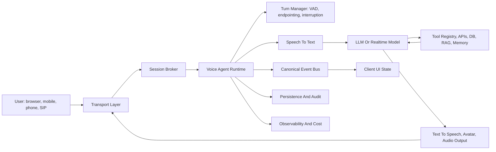
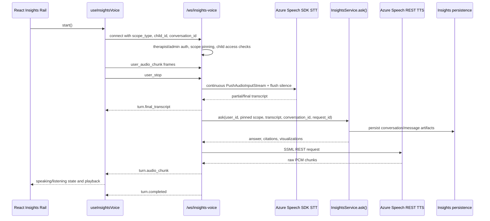

# Generic Voice-Agent Architecture And Wulo Insights Voice Assessment

Date: 2026-04-30
Audience: product engineering, AI architecture, platform, security, and clinical workflow owners

## Executive Summary

A production voice agent is not only STT plus an LLM plus TTS. It is a realtime session system that coordinates audio transport, turn-taking, interruption handling, model orchestration, tools, persistence, safety, and observability under a single lifecycle.

LiveKit, Vapi, and Azure Voice Live solve overlapping parts of that system, but at different abstraction levels:

- LiveKit is a composable realtime media and agent framework. It gives the most control over transport, rooms, provider choice, turn behavior, and agent runtime.
- Vapi is a managed voice-agent platform optimized for phone and web calls. It owns much of the call infrastructure and exposes assistants, calls, squads, tools, and webhooks as product primitives.
- Azure Voice Live is an Azure-native managed realtime speech and avatar conversation service. It is strongest where Azure Speech, Azure OpenAI, managed identity, and avatar streaming should be one integrated loop.

Wulo's Insights voice agent is currently a focused, in-product voice interface for the therapist Insights Rail. It already has several mature patterns: a long-lived WebSocket session, a provider-neutral `turn.*` envelope, continuous Azure Speech STT, streaming Azure TTS, client-side VAD, barge-in, false-interruption recovery, therapist authorization, pinned scope, and conversation persistence through `InsightsService.ask()`. Compared with the generic architecture and the vendor platforms, the main gaps are multi-provider abstraction, server-side contextual endpointing, first-class tool-event streaming, richer session observability/cost records, formal user-state modeling, replayable audio/audit artifacts, and multi-agent/workflow orchestration.

## The Generic Architecture

The generic voice-agent platform should be designed as a provider-neutral voice session runtime. Vendor services are adapters behind the runtime, not the application architecture itself.



### Core Components

| Component | Responsibility | Generic contract |
|---|---|---|
| Client surface | Captures microphone input, plays audio, renders state, handles permissions | Web, mobile, desktop, phone, SIP, or embedded widget |
| Transport layer | Moves realtime audio and control events | WebRTC, WebSocket PCM, SIP, telephony bridge, or vendor SDK |
| Session broker | Authenticates user, scopes tenant/resource access, creates or joins sessions | `start_session`, `join_info`, `end_session` |
| Turn manager | Detects speech, decides end of turn, handles barge-in and false interruption | VAD, endpointing, interruption policy, echo suppression |
| STT adapter | Converts audio stream to partial and final transcripts | `partial_transcript`, `final_transcript`, confidence, timings |
| Model adapter | Produces assistant reasoning, text, tool calls, and response tokens | LLM, realtime speech model, workflow engine, or planner |
| Tool runtime | Executes actions under app permissions and audit controls | Sync/async tool calls, confirmations, result injection |
| TTS/output adapter | Converts assistant response to playable audio/video/avatar | Audio chunks, visemes, captions, avatar frames, interruption cancel |
| Memory/RAG | Supplies durable context and retrieval | App-owned, permissioned, inspectable, and revocable |
| Persistence | Records neutral session artifacts | Session, turn, transcript, tool call, result, metrics, audit |
| Observability | Measures quality, failures, latency, and spend | Turn traces, TTFT/TTFA, STT/TTS latency, tokens, audio seconds |

### Canonical Event Contract

The application should normalize every provider into one event envelope. This prevents the UI, storage, and safety model from becoming vendor-specific.

```text
session.ready
state.changed
input_audio.start
input_audio.chunk
input_audio.end
turn.started
turn.partial_transcript
turn.final_transcript
turn.delta
turn.reasoning_summary
turn.tool_started
turn.tool_completed
turn.confirmation_required
turn.audio_chunk
turn.completed
turn.interrupt
turn.interrupted
turn.error
session.ended
```

### Session State Model

A robust voice agent should be long-lived across turns. Reconnecting per utterance is usually the wrong abstraction because it adds handshake latency, resets audio context, makes barge-in harder, and breaks the user's sense of continuity.

Recommended states:

```text
initializing -> listening -> user_speaking -> endpointing -> thinking -> tool_waiting -> speaking -> listening
                                                                       -> interrupted -> listening
                                                                       -> error -> listening | ended
listening -> away -> listening | ended
```

Recommended defaults, adaptable by domain:

| Setting | Practical default | Why it matters |
|---|---:|---|
| Minimum speech duration | 50-200 ms | Catches short utterances without reacting to noise |
| Endpointing minimum delay | 500 ms | Prevents clipping the user at the first silence |
| Endpointing maximum delay | 1500-3000 ms | Gives uncertain turns room to finish |
| Interruption hold | 500 ms | Avoids treating coughs or echo as barge-in |
| False interruption timeout | 2000 ms | Allows paused assistant audio to resume after noise |
| AEC warmup after assistant audio starts | 2000-3000 ms | Reduces self-interruption from speaker echo |
| User-away timeout | 15 s | Idles the UI without closing the session |
| Max unrecoverable errors | 3 | Keeps transient vendor failures from ending the session too eagerly |

## Provider Responsibilities

### Azure Voice Live API

Azure Voice Live is a managed Azure conversation loop for realtime speech and, when configured, avatar output. In the Wulo product architecture it is used for child practice sessions, not the therapist Insights voice rail.

What Voice Live takes care of:

- Realtime voice session orchestration against Azure AI services.
- WebRTC bootstrap and media exchange for the live session experience.
- Azure Speech integration for speech input/output behavior.
- Azure OpenAI or Azure AI model integration through Azure-native auth and deployment boundaries.
- Avatar/audio streaming when configured.
- Function-tool style callbacks through session configuration.
- Managed identity and Azure RBAC compatibility when wired through the app correctly.

What the application still owns:

- User authentication, tenant and child access control.
- Prompt policy, exercise/scenario design, and safety constraints.
- Tool implementation, permissions, and durable audit.
- Cross-session memory, persistence, recommendation logic, and therapist review workflow.
- Product-specific fallback, analytics, and compliance posture.

Architecture implication: Voice Live is strongest when the app can let the managed Azure session own the realtime conversation loop. It is less suitable when the app must splice an existing synchronous service, custom planner, or complex domain workflow into every turn without giving the realtime service control of the turn loop.

### Vapi

Vapi is a managed voice-agent platform centered on assistants, calls, phone numbers, web calls, tools, and squads.

What Vapi takes care of:

- Phone and web call setup for inbound and outbound voice agents.
- Assistant configuration using first message, system prompt, model, transcriber, and voice.
- Provider selection across STT, LLM, and TTS vendors.
- Phone number and telephony provider integration, including carrier-backed call flows.
- Web SDK call startup and event handling for embedded voice experiences.
- Tool execution paths through default tools, custom webhook tools, code tools, and integrations.
- Squads for multi-assistant flows with context-preserving transfers.
- Call lifecycle events, status updates, transcripts, end-of-call reports, and webhooks.

What the application still owns:

- Business object permissions and side-effect approval.
- Tool endpoint implementation and idempotency.
- Customer or patient data governance.
- Long-term memory strategy and product-specific storage.
- Evaluation, compliance review, and deeper workflow-specific UX.

Architecture implication: Vapi is the fastest path for phone-first agents and operational workflows such as sales qualification, appointment scheduling, customer support, and call routing. The tradeoff is that the platform owns more of the call runtime, so the app should integrate through Vapi's assistant, tool, webhook, and squad primitives instead of trying to fully control the low-level media loop.

### LiveKit

LiveKit is an open realtime media platform plus an agent framework. It provides a WebRTC SFU, client SDKs, SIP/telephony integration, and Python/Node agent runtimes.

What LiveKit takes care of:

- Realtime WebRTC rooms, media tracks, data streams, and participant lifecycle.
- A production SFU that can be hosted by LiveKit Cloud or self-hosted.
- Agent workers, job dispatch, and long-lived `AgentSession` orchestration.
- Plugin-based STT, LLM, realtime-model, and TTS provider integration.
- Turn detection, VAD, endpointing, adaptive interruption, and session state patterns.
- Tool definitions, MCP integration, frontend tool forwarding, handoffs, and workflows.
- SIP and telephony integration, recording/egress, and external media ingress.
- Testing and debugging surfaces for multi-turn agents.

What the application still owns:

- Product authorization, domain policy, data model, and side-effect governance.
- Prompt and workflow design.
- Clinical/business persistence, reporting, review, and memory lifecycle.
- Vendor choice, cost policy, and deployment topology.

Architecture implication: LiveKit is the best fit when Wulo needs full control over realtime UX, provider choice, multi-user rooms, telephony extensions, or sophisticated turn behavior. It requires running or depending on a dedicated realtime media/agent platform, but it exposes the cleanest generic model for a reusable voice-agent runtime.

## Wulo Insights Voice Architecture Today

Wulo Insights voice is not the same subsystem as the child practice Voice Live flow. It is a therapist-facing voice interface for the Insights Rail, implemented inside the existing React plus Flask-Sock stack.

Current high-level flow:



### Backend Shape

- Route: `/ws/insights-voice` in `backend/src/app.py`.
- Feature gate: `INSIGHTS_VOICE_MODE`, exposed through `/api/config` as `insights_voice_mode`.
- Auth: therapist/admin role required at WebSocket connect.
- Scope: `scope_type`, optional `child_id`, and optional `conversation_id` are pinned from the URL at connect time.
- Access control: child scope checks `user_has_child_access`; conversation IDs must belong to the user.
- Handler: `InsightsVoiceHandler` in `backend/src/services/insights_websocket_handler.py`.
- STT: Azure Speech SDK continuous recognizer with a long-lived recognizer session and per-turn reset state.
- Turn finalization: client sends `user_stop`; backend writes 2 seconds of silence to flush STT and waits for final recognition.
- Model/workflow: synchronous `InsightsService.ask()` receives the transcript and existing pinned scope.
- TTS: Azure Speech REST TTS streams `raw-24khz-16bit-mono-pcm` chunks back over the same WebSocket.
- Interruption: backend polls for `turn.interrupt` during TTS streaming and returns `turn.interrupted` after closing the response stream.
- Diagnostics: structured `[insights-voice-stt]` and `[insights-voice-timing]` logs record recognizer/session/turn timing.

### Frontend Shape

- Hook: `frontend/src/hooks/useInsightsVoice.ts` owns connection, microphone, VAD, playback, and state.
- Audio input: `useRecorder` produces 24 kHz Int16 PCM base64 frames.
- Audio output: Web Audio API decodes raw PCM chunks and schedules playback on an `AudioContext` at 24 kHz.
- State: `idle`, `connecting`, `listening`, `thinking`, `speaking`, `interrupted`, `error`.
- Full-duplex behavior: `push_to_talk` is normalized to `full_duplex`, so current runtime behavior is effectively auto-listening/full-duplex once enabled.
- Endpointing: client-side amplitude VAD arms after sustained speech, then sends `user_stop` after silence.
- Current tuning: speech threshold `0.12`, silence min delay `500 ms`, max delay `1500 ms`, VAD warmup `400 ms`, AEC warmup `2000 ms`, interruption threshold `0.15`, interruption hold `500 ms`, confirmation `250 ms`, false-interruption timeout `2000 ms`.
- Barge-in: while speaking, the hook monitors mic input, pauses playback tentatively, confirms sustained speech, sends `turn.interrupt`, and forwards buffered user audio into the next turn.
- False interruption: if sustained speech does not continue, playback resumes and the recorder returns to monitor mode.

### Existing Provider-Neutral Contract

Wulo already defines a useful neutral envelope in `frontend/src/types/index.ts`:

```text
state
turn.started
turn.partial_transcript
turn.final_transcript
turn.reasoning_summary
turn.tool_started
turn.tool_completed
turn.confirmation_required
turn.delta
turn.citation
turn.audio_chunk
turn.completed
turn.error
turn.interrupt
turn.interrupted
```

This is the right architectural direction. It lets Wulo preserve the product UI and persistence model even if the underlying provider later changes to LiveKit, Vapi, Voice Live, OpenAI Realtime, or another stack.

## Gap Analysis

### What Wulo Already Has

| Capability | Status | Notes |
|---|---|---|
| Long-lived session across turns | Present | The backend keeps one WebSocket and one continuous recognizer alive until session close. |
| Provider-neutral turn envelope | Present | `turn.*` contract is already broader than the current implementation. |
| Therapist auth and child scope guard | Present | Connect-time checks pin scope and conversation. |
| Streaming STT partials | Present | Backend emits partial transcript events from Azure Speech recognizing callbacks. |
| Streaming TTS playback | Present | REST TTS chunks are streamed as raw PCM. |
| Barge-in | Present | Client sends `turn.interrupt`; backend cancels TTS stream. |
| False-interruption recovery | Present | Client pauses tentatively, then resumes if speech does not continue. |
| AEC warmup | Present | Client suppresses interruption during early playback. |
| Conversation persistence | Present | Reuses `InsightsService.ask()` and existing insight conversation storage. |
| Latency diagnostics | Present | Console and backend timing logs exist. |

### Missing Compared With The Generic Target

| Gap | Impact | Recommended direction |
|---|---|---|
| No provider adapter boundary | Azure Speech and Flask-Sock assumptions leak into the runtime. | Introduce `VoiceSessionProvider` and keep Azure Speech as the first adapter. |
| Endpointing is client amplitude-based | Less robust than server VAD or context-aware endpointing; browser input levels vary. | Add server-side VAD or contextual EOU model later; keep client VAD as early signal. |
| No formal user state | Only agent-oriented state is emitted; user state such as `speaking`, `listening`, `away` is inferred. | Add `user_state` events and an away timer. |
| Tool events are reserved but not live | The UI cannot show tool progress, confirmations, or long-running actions. | Stream `turn.tool_started`, `turn.tool_completed`, and `turn.confirmation_required` from `InsightsService` or a future workflow engine. |
| `InsightsService.ask()` is synchronous | First audio can be delayed by planner/tool latency; no token-level or reasoning streaming. | Add streaming planner output or an async turn runner with cancellation. |
| No first-class session record for voice metrics | Logs exist, but voice session metrics are not a durable product artifact. | Persist session/turn latency, audio seconds, transcript timings, model cost, and interruption count. |
| No recording or replay pointer | Harder to debug clinical UX or audit user-reported issues. | Add opt-in, policy-controlled recording or short diagnostic buffers where legally appropriate. |
| No multi-agent orchestration | Current Insights voice is one assistant surface. | Model future specialized agents through tool/workflow routing or a provider such as Vapi Squads/LiveKit handoffs. |
| No telephony bridge | Therapist rail is browser-only. | Use Vapi or LiveKit SIP if phone-based therapist/admin workflows become real requirements. |
| No provider capability matrix | Product cannot choose provider per use case at runtime. | Define capability flags: `supports_phone`, `supports_avatar`, `supports_room`, `supports_tool_stream`, `supports_server_vad`, etc. |

### Missing Compared With Voice Live

- Managed avatar/video streaming for Insights voice.
- Azure-managed realtime conversation loop.
- Voice-session configuration that natively joins STT, model, TTS, and avatar in one managed service.
- Stronger fit for speech/avatar experiences where Wulo can let Azure own the realtime turn loop.

This is not automatically a defect. Insights deliberately keeps `InsightsService.ask()` in control because the therapist rail depends on existing scope guards, persistence, citations, visualizations, and planner behavior.

### Missing Compared With Vapi

- Phone number, inbound, and outbound call primitives.
- Managed call reports, webhook lifecycle, and carrier integrations.
- Assistant and squad primitives for multi-assistant routing.
- Managed tool/webhook integration patterns designed around operational phone workflows.
- Dashboard-first assistant iteration.

This matters if Wulo later wants phone-based therapist support, parent reminders, booking flows, clinic intake calls, or outbound nudges. It matters less for an embedded therapist dashboard voice rail.

### Missing Compared With LiveKit

- WebRTC room abstraction and SFU-based media routing.
- Multi-participant sessions and richer media tracks.
- Plugin ecosystem for swapping STT, LLM, realtime model, and TTS providers.
- Mature server-side turn detection, adaptive interruption, and handoff/workflow primitives.
- Agent worker lifecycle and job dispatch independent of the Flask request worker.
- LiveKit testing/debugging patterns for multi-turn agents.

This matters if Wulo wants a general voice platform across therapist, child, parent, phone, and group-session surfaces rather than a single dashboard voice feature.

## Recommended Target Architecture For Wulo

Wulo should keep the current Insights voice implementation as the narrow, working path, but define a reusable voice session abstraction above it.

```text
WuloVoiceSessionService
  - validates user, role, workspace, child/session/report scope
  - creates provider session through VoiceSessionProvider
  - normalizes all provider events into turn.* envelopes
  - owns tool permissions, confirmations, audit, and persistence
  - emits UI-safe state to React

VoiceSessionProvider interface
  - AzureSpeechWebSocketProvider      current Insights implementation
  - AzureVoiceLiveProvider            child/avatar or future managed loop
  - LiveKitProvider                   future multi-room/custom realtime path
  - VapiProvider                      future phone/web-call operational path
```

Provider capability flags should be explicit:

```text
supports_browser_audio
supports_phone_calls
supports_sip
supports_avatar
supports_server_vad
supports_contextual_endpointing
supports_barge_in
supports_false_interruption_resume
supports_tool_streaming
supports_multi_agent_handoff
supports_recording
supports_managed_identity
```

## Architecture Roadmap

### Phase 1: Consolidate Current Strengths

- Document the `turn.*` contract as the canonical Wulo voice event schema.
- Persist voice turn metrics beyond logs: transcript latency, ask latency, first audio latency, playback duration, interruptions, and errors.
- Add `user_state` and `away` events so UI state is less inferred.
- Keep the existing Azure Speech path stable because it already fits `InsightsService.ask()`.

### Phase 2: Make Tools First-Class In Voice

- Stream tool start/completion events from the planner or an async wrapper.
- Use `turn.confirmation_required` for write actions such as email, reminders, or notifications.
- Add idempotency keys and audit entries for voice-triggered side effects.
- Support long-running tools through background jobs and late `turn.tool_completed` events.

### Phase 3: Improve Turn Intelligence

- Move from pure amplitude VAD toward server-side VAD or contextual end-of-utterance detection.
- Add transcript holding or filtering during assistant speech on the backend, not only client-side interruption management.
- Consider preemptive LLM generation on high-confidence interim transcripts when cancellation is safe.

### Phase 4: Introduce Provider Adapters

- Keep Azure Speech WebSocket as the default Insights provider.
- Evaluate LiveKit if Wulo needs richer realtime rooms, provider choice, or multi-participant media.
- Evaluate Vapi if Wulo needs phone-first parent, clinic, sales, onboarding, or booking agents.
- Use Voice Live where avatar-led Azure-native realtime sessions should own the conversation loop.

## Design Decision Guidance

| Use case | Best-fit provider | Reason |
|---|---|---|
| Therapist dashboard voice assistant | Current Azure Speech + Wulo runtime | Keeps `InsightsService.ask()`, citations, visualizations, auth, and persistence in Wulo. |
| Child avatar-led speech practice | Azure Voice Live | Azure-native realtime speech/avatar loop fits the product surface. |
| Phone-based support, scheduling, reminders, or outreach | Vapi | Phone, assistant, call, webhook, and squad primitives are already productized. |
| Multi-user realtime session, custom media UX, or provider-agnostic voice platform | LiveKit | WebRTC room/SFU model and agent framework provide the deepest control. |
| Cross-provider experimentation | Wulo provider abstraction | Keeps app state, tools, and storage stable while swapping vendors. |

## Bottom Line

The right Wulo architecture is not to choose one vendor as the whole architecture. The right architecture is a Wulo-owned voice session layer with provider adapters underneath it.

The current Insights voice implementation is a credible first provider adapter: it is scoped, secure, long-lived, and already uses a clean event envelope. The next architectural step is to formalize that envelope and lifecycle as a reusable platform boundary, then add the pieces that vendor products already demonstrate: durable voice observability, stronger endpointing, first-class tool streaming, multi-agent orchestration, and provider capability selection.
